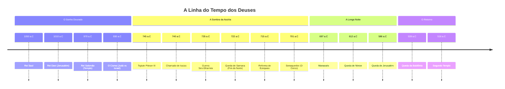

# Cronologia: A Ascensão e Queda dos Reis
**Contexto:** [[A Batalha dos Deuses]]
**Tags:** #história #cronologia #contexto-bíblico #geopolítica

---

## 🏛️ Parte 1: O Sonho Dourado (Visão Macro)
*Quando éramos um só povo e uma só espada.*

* **~1050 a.C. | [[Rei Saul]]:** A fundação monárquica. O começo desajeitado.
* **~1010 a.C. | [[Rei Davi]]:** A conquista de [[Jerusalém]]. A expansão militar máxima. As fronteiras vão do Egito ao Eufrates.
* **~970 a.C. | [[Rei Salomão]]:** O auge econômico e cultural. A construção do [[Primeiro Templo]]. A semente da idolatria política.
* **~930 a.C. | O Cisma (A Rachadura):**
    * O Reino divide-se em dois.
    * **Norte:** [[Israel]] (ou Efraim/Samaria) - 10 tribos. Instável, idólatra, rico.
    * **Sul:** [[Judá]] - 2 tribos (Judá e Benjamim). Dinastia davídica, Templo, isolado.

---

## 🦅 Parte 2: A Sombra da Assíria (A Era de Isaías)
*Onde a nossa história realmente acontece. O mundo começa a ficar pequeno e perigoso.*

### O Prelúdio (A Calmaria)
* **~790–740 a.C. | [[Uzias]] (Judá) e [[Jeroboão II]] (Israel):**
    * Um período estranho de prosperidade para ambos os reinos. A Assíria estava dormindo (problemas internos).
    * O orgulho cresce. O rico oprime o pobre. É aqui que [[Isaías]] e [[Amós]] começam a denunciar a podridão social.

### O Despertar do Monstro (Reinado de Acaz)
* **~745 a.C. | [[Tiglute-Pileser III]] (Assíria):**
    * O rei assírio reorganiza o império e inventa a **Deportação em Massa** como política de estado. A máquina liga.
* **~740 a.C. | O Chamado:** Morre o Rei Uzias. [[Isaías]] vê o Senhor no Templo (Isaías 6).
* **~735–732 a.C. | A [[Guerra Siro-Efraimita]]:**
    * **O Cenário:** [[Rezim]] (Síria/Arã) e [[Peca]] (Israel/Samaria) formam uma aliança para parar a Assíria.
    * **A Pressão:** Eles tentam forçar [[Acaz]] (Judá) a entrar na briga. Acaz recusa.
    * **O Cerco:** Síria e Israel cercam Jerusalém para depor Acaz.
    * **O Erro Fatal:** Contra o conselho de Isaías ("*Emanuel*"), Acaz pede socorro à Assíria e se torna vassalo dela. Ele copia o altar pagão de Damasco e coloca dentro do Templo.
    * **O Resultado:** A Assíria desce, destrói a Síria, depreda o Norte (Galileia) e deixa Judá endividado e espiritualmente prostituído.

### A Queda do Norte (Início do Reinado de Ezequias)
* **~727 a.C. | [[Salmaneser V]] (Assíria):** Começa o cerco final a Samaria.
* **722 a.C. | A [[Queda de Samaria]]:**
    * **O Trauma:** Sargão II (sucessor) finaliza o serviço. O Reino do Norte deixa de existir.
    * **O Exílio:** As 10 tribos são levadas e dispersas.
    * **O Impacto em Judá:** Refugiados inundam Jerusalém. A cidade cresce 4x de tamanho (bairro da Colina Ocidental). O medo se instala: *"Se Deus não poupou Samaria, por que pouparia Jerusalém?"*

### A Revolta e o Cerco (O Palco do Conto)
* **715–705 a.C. | A Reforma de [[Ezequias]]:**
    * Ezequias reabre o Templo, quebra os postes-ídolos e a serpente de bronze.
    * Ele centraliza o culto (isso irrita os camponeses que perdiam seus altares locais).
* **705 a.C. | Morte de [[Sargão II]]:**
    * O rei assírio morre em batalha. O império treme. Babilônia e Egito incitam revoltas.
* **704 a.C. | O Grito de Independência:**
    * Ezequias para de pagar o tributo.
    * Aliança (secreta e condenada por Isaías) com o [[Egito]] e a [[Babilônia]] (visita de Merodaque-Baladã).
    * Preparação: Construção do [[Túnel de Siloé]] e da Muralha Larga.
* **701 a.C. | A Campanha de [[Senaqueribe]]:**
    * O assírio desce pelo litoral (Fenícia, Filístia).
    * Derrota os egípcios em Elteque (o "bordão quebrado").
    * Destruição de [[Laquis]] (a segunda maior cidade de Judá).
    * **O Cerco de Jerusalém:** O clímax da nossa história.
    * **O Desfecho:** A morte misteriosa de 185.000 soldados. Senaqueribe volta para Nínive.

---

## 🌑 Parte 3: A Longa Noite e o Fim (Pós-Isaías)
*O pêndulo volta com força para a escuridão.*

* **~697–642 a.C. | [[Manassés]]:**
    * Filho de Ezequias (nascido nos 15 anos extras de vida do pai).
    * O pior rei de Judá. Restaura toda a idolatria, queima os próprios filhos a Moloque.
    * **Tradição:** Serrou o profeta [[Isaías]] ao meio.
    * Judá volta a ser vassalo submisso da Assíria.
* **612 a.C. | Queda de [[Nínive]]:** A Assíria cai para a Babilônia.
* **609 a.C. | Morte de [[Josias]]:** O último bom rei morre tentando parar o Egito.
* **586 a.C. | A [[Queda de Jerusalém]]:**
    * [[Nabucodonosor]] (Babilônia) destrói a cidade e o Templo.
    * O Fim da Monarquia. O Exílio na Babilônia.

---

## 🌅 Parte 4: O Retorno (Overview Final)
* **539 a.C. | A Queda da Babilônia:** Ciro, o Persa, conquista tudo.
* **538 a.C. | O Edito de Ciro:** Permissão para voltar.
* **516 a.C. | O Segundo Templo:** Reconstruído (menor e mais humilde).

## 📊 Visualização Gráfica

