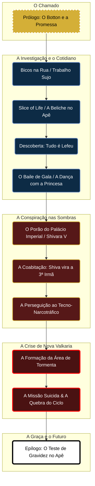

# 🌌 Projeto: Canção de Nova Valkaria

## 📋 Conceito Central
Um romance cyberpunk-fantástico com aventura e *slice of life*, ambientado na metrópole neon de Nova Valkaria 1.000 anos no futuro de Arton. 

Narra a história de **Lira**, uma bardo élfica imortal e testemunha-narradora, e **Valéria**, a trigésima mulher a carregar um manto divino de redenção sob o princípio do *Sola Gratia*. Enquanto investigam o retorno silencioso da Tormenta sob a forma de um vírus de tecno-narcotráfico, elas tentam viver a humanidade do dia a dia em um apartamento de dois quartos em Deheon.

---

## 🎨 A Estética Unificadora (Realismo Poético Brutal)
* **Textura:** Neon, chuva ácida, ferrugem, fumaça de café, solda quente, graxa e milagre.
* **Ameaça:** A Tormenta não vem do céu como chuva de sangue, mas entra pelas veias e chips como um vírus cibernético de matemática aberrante.
* **Redenção:** A graça de Valkaria não é merecida por martírio; é aceita na vulnerabilidade do cotidiano.

---

## 🗺️ O Mapa da Canção (Roadmap Narrativo)

---

## 👥 As Peças do Tabuleiro (O Squad)

* 🛡️ **Valéria (A Trigésima):** Humana, Músculos, Vanguarda e Tática. Carrega o trauma purista e uma pulsão suicida de penitência (*Sola Gratia*).
* 🎶 **Lira:** Elfa Imortal, Deuteragonista/Testemunha. Carisma, Infiltração, Magia de Bardo e DJ. A intercessora que já viu quatro Shivaras passarem.
* 👑 **Princesa Shivara Sharpblade (Shiva):** Humana (20 anos), Neta de Shivara V. Furtividade, Liderança e Acesso de Elite. A "3ª irmã" na beliche.
* 🧠 **Éric:** Humano Neurodivergente (TEA/TDAH), Hardware Hacking, Bugigangas e Overwatch Remoto. O Dev de infra da equipe (e ship oficial da Shiva).

---

## 📚 A Estrutura da História

### 🌆 Prólogo: O Botton e a Promessa
* **O Inimigo:** O Esquecimento.
* **Tema:** A Eleição.
* **Atmosfera:** Metrô subterrâneo, tiro, fumaça e neon. Lira como DJ, empunhando pistola e flauta mágica, intervindo num assalto e recebendo o botton da estátua de Valkaria de uma garota misteriosa.
* **Link:** [[Prólogo]]

### 🛋️ Ato 1: Padrão "Bico da Semana" & O Estalo do Horror
* **O Inimigo:** O crime organizado de sarjeta & A Amostra Zero do Vírus.
* **Tema:** A Rotina e o Afeto.
* **Atmosfera:** Cidades de sarjeta, lutas de rua e *Slice of Life* no apê de dois quartos. Valéria e Lira dividindo o quarto e a beliche.
* **O Clímax do Ato:** A apreensão de uma carga de droga sintética com a gravação *"Tudo é Lefeu"*. O pânico visceral de Lira ao reconhecer a assinatura da Tormenta. O convite secreto para o Baile de Gala no Palácio Imperial de Deheon e a dança com a Princesa Shiva.
* **Link:** 

### 👑 Ato 2: O Porão do Palácio & A Terceira Irmã
* **O Inimigo:** Os Distribuidores da Droga & Os Espectros do Passado.
* **Tema:** A Conspiração Política e a Família Encontrada.
* **Atmosfera:** O contraste entre o luxo de Deheon e o porão analógico mofado da idosa Rainha Imperatriz Shivara V.
* **A Virada:** A Princesa Shiva sofre um atentado e passa a morar com elas no apê (dormindo na cama de cima da beliche da Lira!). Tensão romântica/encabulada entre Éric e Shiva durante as noites de pizza.
* **Link:** 

### ⛈️ Ato 3: A Névoa Vermelha sobre Nova Valkaria
* **O Inimigo:** O Apocalipse Tecno-Lefeu.
* **Tema:** O *Sola Gratia* e a Sobrevivência.
* **Atmosfera:** Caos absoluto. Zero *slice of life*. Uma Área de Tormenta se abre pela primeira vez em séculos no meio da metrópole.
* **O Clímax:** Valéria tenta uma missão suicida por achar que precisa "pagar o preço", mas a graça de Valkaria e o amor do grupo quebram o ciclo das 29 Valérias anteriores. Ela sobrevive.
* **Link:**

### 👶 Epílogo: O Banheiro e o Milagre
* **O Inimigo:** A Incerteza do Amanhã.
* **Tema:** A Vida Renovada.
* **Atmosfera:** Simplicidade mundana, alívio pós-tempestade.
* **A Cena:** Três garotas e um Dev no apê, olhando para um teste de gravidez no balcão do banheiro. A semente plantada para a filha elfa/milagre do Livro 2 (onde os Puristas da BioMed serão os vilões principais).
* **Link:**

---

## ⏳ Linha do Tempo Interna (Livro 1)

| Fase        | Duração Aprox. | Foco Narrativo                      | Tom Preponderante                               |
| :---------- | :------------- | :---------------------------------- | :---------------------------------------------- |
| **Prólogo** | 1 Noite        | O Sinal de Valkaria                 | Ação Cyberpunk & Mistério                       |
| **Ato 1**   | 2 a 3 Meses    | Bicos, Beliche no Apê, Investigação | Urban Fantasy + Slice of Life                   |
| **Ato 2**   | 2 a 4 Semanas  | Porão do Palácio, Shiva no Apê      | Thriller Político + Comédia Romântica/Cotidiana |
| **Ato 3**   | 48 Horas       | Crise da Área de Tormenta           | Terror Cósmico & Ação Desesperada               |
| **Epílogo** | 1 Manhã        | O Apê / Teste de Gravidez           | Drama Humano & Esperança                        |
