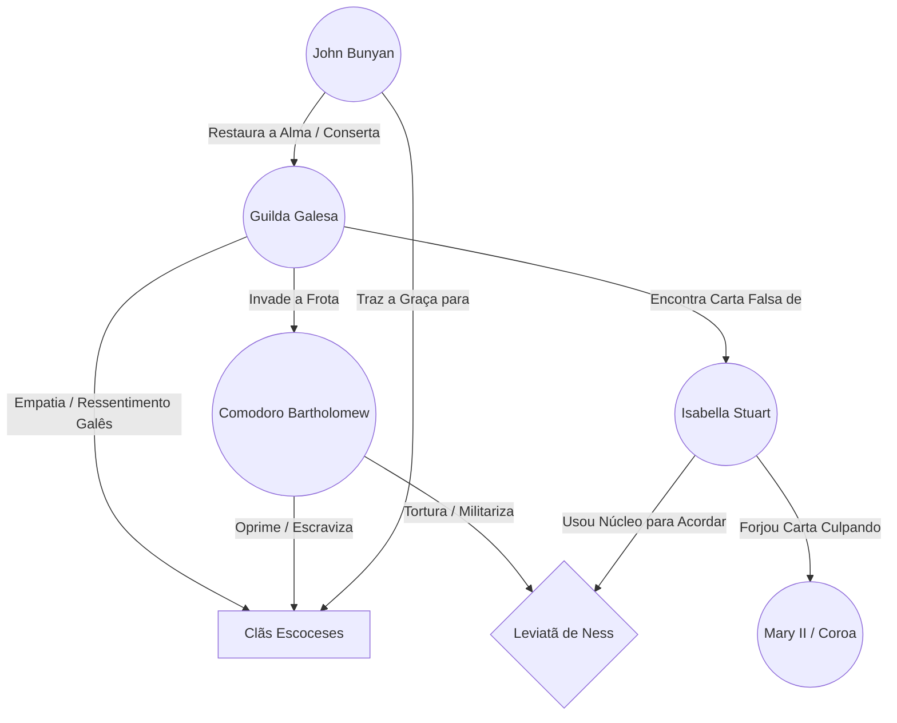

---
tags:
  - projeto/rpg
  - campanha/fabula-ultima
  - status/producao
  - tema/realismo-poetico
sistema: Fabula Ultima
tipo: Episodio
relogio_frota: 0
relogio_leviata: 0
relogio_afogamento: 0
---

# 🍎 A Frota de Chumbo: As Águas de Ness
> "As correntes que forjamos com as nossas próprias mãos são sempre as mais pesadas. O ferro prende o corpo, mas apenas o orgulho afoga a alma." — John Bunyan

## 📜 Logline e Atmosfera
Em busca de refúgio e trabalho, a Guilda dos Bigodudos (agora longe das ruínas de Woolsthorpe) chega às nebulosas Terras Altas da Escócia, nas margens do Lago Ness. Mas o que deveria ser um local de magia druídica antiga tornou-se uma zona de guerra industrial. O exército absolutista do Rei Jaime II ancorou uma balsa-fábrica no meio do lago, usando tecnologia gravitacional corrompida ("Ganchos de Chumbo") para torturar e militarizar o lendário Leviatã de Ness. O grupo galês, conhecendo bem o gosto da bota inglesa em seu pescoço, precisará invadir a frota, decidir o destino da fera e lidar com uma pista falsa deixada nas sombras pela verdadeira arquiteta do caos.

## 🎭 A Teia da Conspiração (Grafo de Relações)
O jogo político e a dor da terra escocesa, mapeados via mermaid-tools.



## 🏘️ O Hub do Desespero: As Margens de Urquhart
O lago está fraturado. Esferas de água flutuam pelo ar e peixes nadam no céu enevoado. As margens estão ocupadas militarmente.

* **O Peso da Opressão:** Comodoro Bartholomew (o oficial sádico de armadura a vapor, "O Vilão da Semana") e Tenente Sterling (o lacaio burocrata que odeia o frio escocês).
* **A Tradição Sangrando:** Alistair MacGregor (líder de clã ferido, orgulhoso demais para pedir ajuda a galeses) e Morag (velha druida tentando acalmar as águas cantando canções antigas que já não funcionam).
* **O Oásis da Graça:** John Bunyan (o Funileiro Profeta, forjando escudos e consertando a física local com sua fogueira).
* **A Fera Vítima:** O Monstro do Lago Ness (um Dragão Serpente Ancestral sofrendo de doença descompressiva mágica e enlouquecido de dor).

## ⚙️ Painel do Mestre (Meta Bind + Dice Roller)
Controle o caos militar e aquático sem sair desta página.

### ⏳ Relógios de Perigo
Altere o slider no modo Live Preview para preencher os relógios.

**Alerta da Frota de Chumbo:** ( `VIEW[{relogio_frota}]` / 6 )
```meta-bind
INPUT[slider(minValue(0), maxValue(6)):relogio_frota]
```

**A Agonia do Leviatã:** ( `VIEW[{relogio_leviata}]` / 4 )
```meta-bind
INPUT[slider(minValue(0), maxValue(4)):relogio_leviata]
```

**Mal das Águas Profundas:** ( `VIEW[{relogio_afogamento}]` / 6 ) 
```meta-bind
INPUT[slider(minValue(0), maxValue(6)):relogio_afogamento]
```

### 🎲 Anomalias da Balsa-Fábrica
Clique no dado quando o grupo avançar pela frota ou pular pelas águas: `dice: 1d6`

| 🎲 | Anomalia | A Cena (Narrativa) | O Preço (Mecânica) |
| --- | --- | --- | --- |
| 1 | **Chuva Ascendente** | A água sobe do lago em direção às nuvens em jatos violentos. | -2 em Precisão à distância. Coberturas normais não funcionam. |
| 2 | **Bolha Estática** | Uma esfera gigante de água engole a área. Movimento vira natação em pleno ar. | Teste 【VIG + VIG】 (Dif 10). Falha: Condição Lento e Dano de Água. |
| 3 | **Ganchos Magnéticos** | Os ganchos de Hooke da frota puxam o metal não ajustado. | Armas/Armaduras pesadas exigem teste 【DES + VIG】. Falha: Atordoado. |
| 4 | **Gêiser de Pressão** | O vapor da balsa e a magia do lago entram em combustão. | Todos ganham Vulnerabilidade a Fogo ou Ar temporária. |
| 5 | **Gravidade Rompida** | O chão do navio flutua. O eixo se perde. | Teste 【DES + VON】 (Dif 10). Falha: +1 seção no Relógio Mal das Águas. |
| 6 | **O Grito da Fera** | O Leviatã uiva de dor. O som estilhaça o vidro e a alma. | Teste brutal 【VON + VON】 (Dif 10). Falha: 30 de dano mental (Crise). |

## ⚙️ As Leis da Inércia Aquática (Regras Especiais)
A água flutuante no cenário muda o campo de batalha:
* **Cobertura Líquida:** Personagens podem usar as bolhas de água voadoras como cobertura para ataques de Fogo (reduzindo o dano pela metade), mas ataques de Raio disparados contra a água causam dano em área (Multi 2) automático.

## 🤢 O Preço do Caos: Mal das Águas Profundas
A energia que a Coroa injeta no lago desorienta os fluidos do corpo humano, similar a uma doença descompressiva.
* **Estágio 1 - Pressão nos Tímpanos (3/6):** Zumbido constante. O grupo sofre **Abalado**.
* **Estágio 2 - Sangue Fervente (6/6):** As veias dilatam com a magia falha. Status agrava para **Enfraquecido**. Curar PV custa o dobro de PM ou Itens.

🧪 **Cura de Improviso: Uísque de Urze Druídico.** Custa 2 PI para consumir. Zera o Relógio, remove os status, mas o álcool e as ervas deixam o usuário **Ofuscado** pela euforia de batalha celta.

## 🕊️ A Forja do Peregrino (Ação de Suporte de John Bunyan)
Bunyan funciona como um "Save Point Ambulante" e uma bússola moral. Num raio de 10 metros de sua fogueira, a física é normal (Oásis de Fé). Em combate, se protegido, Bunyan não ataca, mas oferece as ferramentas da Graça:

1. **Solda da Alma (Suporte):** Bunyan bate seu martelo. Um herói remove imediatamente qualquer condição mental (Abalado, Enfurecido) e recupera 15 PM.
2. **O Escudo do Funileiro (Defesa):** Ele improvisa uma placa de aço nas costas de um herói. O próximo dano físico fatal é reduzido a zero (escudo quebra em seguida).
3. **A Pergunta do Peregrino (Moral):** Bunyan questiona as convicções do inimigo. O Comodoro ou seus tenentes devem fazer um teste de Vontade. Se falharem, perdem sua Ação Principal hesitando perante a culpa de suas ações.

*Atenção:* Bunyan **NUNCA** dá o golpe final e não julgará as escolhas dos heróis sobre o monstro. A decisão heroica pertence ao grupo.

## 🗃️ Banco de Dados da Aventura (Dataview)

### 🗣️ NPCs e Vínculos
```dataview
TABLE tipo, status, localização
FROM #npc AND #fabula-ultima/lago-ness
SORT file.name ASC
```

### 👾 Bestiário e Ameaças
```dataview
TABLE nivel, fraqueza, hp_max
FROM #monstro AND #fabula-ultima/lago-ness
SORT nivel DESC
```

---

# 🍎 RASCUNHO DE MESA: A FROTA DE CHUMBO
**Logline:** A Guilda dos Bigodudos chega à Escócia e encontra o Lago Ness destruído pelo exército absolutista. Eles devem invadir uma balsa-fábrica inglesa que está torturando a mística Fera de Ness, apenas para descobrir que há uma conspiração maior ocultando os passos da Rainha das Sombras.

## ⏱️ Pacing da Sessão (4 Horas)
* **Hora 1:** Chegada às Terras Altas. Tensão xenofóbica com os Clãs, o peso da opressão inglesa e o encontro com John Bunyan (Oásis).
* **Hora 2 e 3:** Invasão Inércia-Cinética. Saltando entre pedaços de terra, bolhas d'água e invadindo os conveses da Frota de Chumbo (Combates contra a Marinha).
* **Hora 4:** Clímax contra o Comodoro Bartholomew e o Leviatã enlouquecido. A invasão do Cofre, a descoberta da Carta Falsa e a "Decisão do Peregrino".

## 📖 LORE EXPRESSA (O que você precisa saber)
* **O Reino NÃO É Unido:** Inglaterra e Escócia são separadas politicamente. O exército de Jaime II no Lago é visto como invasor estrangeiro. A Guilda Galesa entende bem essa dor.
* **A Falsa Pista:** A carta no cofre sugere que a Princesa Mary II e os holandeses estão financiando rebeldes e monstros. É obra de Isabella, criando uma guerra civil para esconder a montagem do Motor Ascendente em Londres.
* **A Dor da Fera:** O Monstro de Ness não é mau; ele é uma vítima arrancada de seu habitat (águas abissais) pelas máquinas inglesas de inversão gravitacional.

## 🗺️ MASMORRA: OS 7 NÓS DA FROTA
* **NÓ 1: Ruínas de Urquhart.** Combate Nvl 5 (Soldados Ingleses com Ganchos a Vapor oprimindo locais). Conexão galesa/escocesa estabelecida.
* **NÓ 2: A Ponte de Água Invertida.** Desafio de Salto/Gravidade Nula. Falhas avançam Relógio de Alerta ou de Mal das Águas.
* **NÓ 3: A Forja do Peregrino.** Ponto Seguro. Interação de fogueira com John Bunyan. Reflexão sobre a bússola moral dos personagens.
* **NÓ 4: Convés Principal.** Invasão furtiva ou tiroteio. Inimigos: "Marinheiros de Chumbo Pesado" (Imunes a empurrões).
* **NÓ 5: Os Aposentos do Comodoro.** Segredo Opcional: O cofre é invadido. A Carta Falsa "assinada" pela oposição é encontrada (Rastro de Isabella).
* **NÓ 6: A Balsa-Fábrica (Boss).** Comodoro Bartholomew (Campeão Nvl 10) usando Armadura Pressurizada e controlando Ganchos Gravitacionais. O Leviatã está acorrentado na arena como perigo ambiental (atacando a cegas).
* **NÓ 7: A Decisão.** Com a máquina quebrada, o Leviatã está livre, mas furioso. O grupo gasta Pontos de Fabula/Diplomacia para acalmá-lo (Graça) ou são forçados a abatê-lo por sobrevivência (Lei Implacável)?