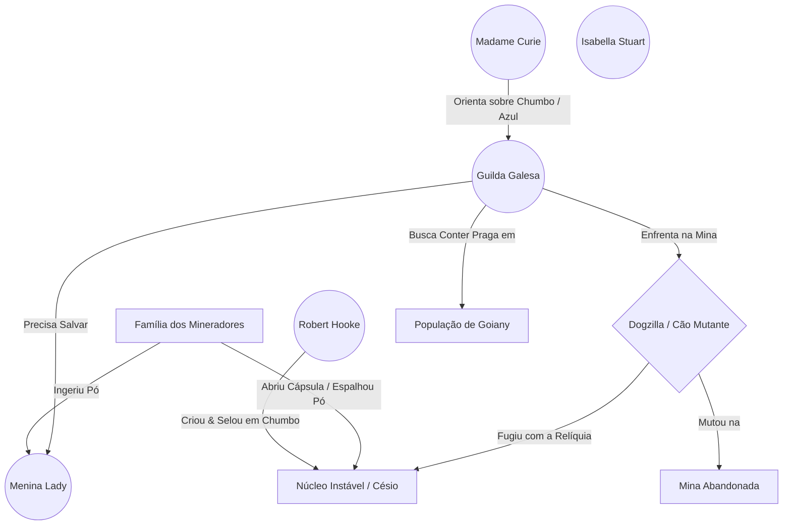

---
tags:
  - projeto/rpg
  - campanha/fabula-ultima
  - status/producao
  - tema/realismo-poetico
  - fabula-ultima/goiany-incident
sistema: Fabula Ultima
tipo: Episodio
relogio_contaminacao: 0
relogio_dosimetria: 0
relogio_atitude: 3
relogio_lady: 0
relogio_chumbo: 0
---

# ☣️ O Incidente de Goiany
> "Pois que aproveita ao homem ganhar o mundo inteiro, se perder a sua alma? Ou que dará o homem em recompensa da sua alma?" — Mateus 16:26

---

## 📜 Backstory (História de Fundo)
Para a construção do núcleo de seu Motor Ascendente, Robert Hook precisava de um material conhecido como Césio. Ele conseguiu isso numa mina próxima à pequena vila de Goiany na Cornualha. O pó e a relíquia (Núcleo Instável) que restaram, ele guardou num recipiente de chumbo e enterrou na mina.

Um grupo de catadores e mineradores encontrou, levou pra casa e abriu no intuito de vender o chumbo, mas encontrou lá dentro um pó que brilhava azul púrpura no escuro. Eles ficaram encantados, passaram no corpo, levaram para as mulheres, deram para os filhos, para os amigos e o pó se espalhou pela cidade. A filha de um dos mineradores, a pequena Lady, inclusive ingeriu o pó. O cachorro da família encontrou a relíquia. Em pouco tempo, muitas pessoas começaram a ficar doentes: náuseas, queda de cabelo, vômito, queimaduras que não saram. O povo está desesperado.

---

## 📍 Como Chegar
* Missão no quadro da guilda (Maldição, incidente em Goiany)
* Encontrar carta com Lorde Maxwell
* Chegando aleatoriamente na vila

---

## 🎭 A Teia da Conspiração (Grafo de Relações)


---

## 🙎 NPCs & Sobreviventes
* **Madame Curie:** Alquimista excêntrica que estuda os compostos brilhantes presentes na mina.
  * É ela quem dá a dica sobre o Chumbo caso a encontrem.
  * O nível de exposição na casa dela é dobrado!
* **Família de Mineradores:** Família simples, com pouco estudo.
  * Esposa e sobrinha altamente contaminadas (difícil salvar; precisam agir com o relógio ainda baixo e fazer um ritual ou teste coletivo muito difícil).
  * Outros membros estão contaminados, mas são mais fáceis de salvar.

---

## ⚙️ Painel do Mestre (Meta Bind)

### ⏳ Relógios da Sessão

**Contaminação da Cidade:** ( `VIEW[{relogio_contaminacao}]` / 10 )
```meta-bind
INPUT[slider(minValue(0), maxValue(10)):relogio_contaminacao]
```

**Dosimetria do Grupo:** ( `VIEW[{relogio_dosimetria}]` / 12 )
```meta-bind
INPUT[slider(minValue(0), maxValue(12)):relogio_dosimetria]
```

**Atitude da Vila:** ( `VIEW[{relogio_atitude}]` / 6 )
```meta-bind
INPUT[slider(minValue(0), maxValue(6)):relogio_atitude]
```

**Salvar Menina Lady & Tia:** ( `VIEW[{relogio_lady}]` / 4 )
```meta-bind
INPUT[slider(minValue(0), maxValue(4)):relogio_lady]
```

**Contenção por Chumbo (Dogzilla):** ( `VIEW[{relogio_chumbo}]` / 4 )
```meta-bind
INPUT[slider(minValue(0), maxValue(4)):relogio_chumbo]
```

---

## 🕐 Detalhamento dos Relógios & Regras

### 1. Contaminação da Cidade (10 segmentos)
* Relógio que determina quando a contaminação da cidade foge de controle.
* **Se completar:** Perdem a cidade, todas as pessoas contaminadas morrem, contaminação escapa da cidade e atinge metrópoles, como Londres.
  * O grupo desconhece todas as consequências.
  * A população comum chama a SAR (Síndrome Aguda de Radiação) de Praga `<escolher_nome>`.
  * O mapa muda, todas as cidades vão ter pessoas morrendo pela praga, o governo fica mais hostil.
  * Impossível reverter, somente com grande Ritual (talvez em Stonehenge, ou em Roma).
  * Rei Jaime é atingido.
  * John Bunyan também.
* **Avanço:** Avança 1 segmento por cena de investigação, independentemente das ações dos jogadores (a menos que façam uma loucura tipo sair jogando pó de Césio pela cidade, aí é game over).
* **Como Interromper:** Para interromper completamente o relógio é preciso encontrar as principais fontes de radiação, queimar, enterrar e cobrir com chumbo ou concreto (informação obtida com Madame Curie).
* **Fontes Principais de Radiação:**
  1. **A cápsula**
  2. **O cachorro com a Relíquia**
  3. **As casas da família e todo o bairro**
  4. **A menina Lady** *(Precisa ser isolada; matar criança não é opção)*
  5. **O Gazofilácio da Igreja** *(Padre/Pastor apoiam, o povo rejeita)*
  6. **O poço da cidade** *(Precisa secar e enterrar o poço)*
* **Reação Popular:** A população não vai querer ter suas coisas enterradas. Cada destruição exige um teste social; se não passar, causa a piora do relógio de atitude da vila. Se chegar a Hostil, ou se tentarem mexer na Igreja ou com a criança e a atitude for menor que Indiferente, a população ataca (matar o povo tem consequências negativas).
* **Detecção:** Madame Curie tem equipamento para detectar focos de radiação. Elementalistas e Inventores podem criar detector usando ritual ou projeto, respectivamente (a realização desse ritual/projeto consome 3 segmentos do relógio de contaminação e exposição).
* **Gargalo:** Se o relógio passar de 3 segmentos, não é mais possível salvar a pequena Lady e sua tia.

---

### 2. Relógio Atitude da Vila (6 segmentos)
* Mede a atitude da vila em relação aos aventureiros.
* **6 níveis:** `0 - Hostil` | `1 - Oponente` | `2 - Inamistoso` | `3 - Indiferente` | `4 - Solícito` | `5 - Amistoso` | `6 - Heróis`
* No nível Hostil, os habitantes (com exceção de Madame Curie) atacam os aventureiros sem questionar sempre que os virem.
* Começa no nível Indiferente, a menos que venham através do pedido de ajuda no quadro de missões, aí começa em Solícito.
* Avança 1 segmento com testes sociais 【AST + VON】 ou 【VON + VON】 bem-sucedidos ou atitudes que claramente visem o bem da vila (como o povo é pouco estudado, atitudes sanitárias em relação ao Césio são vistas como hostis).
* Fracassos em testes sociais ou ações hostis levam ao recuo do relógio.
* Todas as ações necessárias para conter o acidente radiológico são vistas como hostis.
* Mexer com a Lady ou com a Igreja levam imediatamente ao nível Hostil se estiver abaixo de Indiferente.
* Pastor/Padre intercede pelos aventureiros se o nível estiver maior que Indiferente.
* Indiferente não dá bônus em testes sociais; o bônus aumenta em +1 ou diminui em -1 para cada nível que o relógio avança (-3 para Hostil, +3 para Heróis).

---

### 3. Menina Lady e Sua Tia (4 segmentos)
* Será necessário que pelo menos um aventureiro (d8 ou mais de Astúcia) fique cuidando da Lady (-1 se sozinho, 0 se em dupla, +1 em trio) exclusivamente.
* Preencher o relógio faz com que elas sobrevivam.
* Pode ser preenchido ministrando **Azul da Prússia** (informação conseguida com Madame Curie, precisando ser coletado na mina) ou com um ritual de Espiritualista.
* Independentemente do caminho, são necessários 4 sucessos 【AST + AST】.
* 6 falhas ou 2 falhas críticas levam à morte delas.
* Outros contaminados precisam ser isolados; sem necessidade de teste, se o relógio da vila for interrompido e tiverem sido isolados para tratamento, sobrevivem.
* A menina Lady é uma das fontes; tentar isolar a menina ou qualquer outra medida sanitária pode levar imediatamente à hostilidade (vide relógio de atitude).
* Tentar matar ou ferir a menina é falha automática na missão, com todas as consequências descritas acima.

---

### 4. Dosimetria (12 segmentos)
* Nível de contaminação do grupo.
* **Se completar (12 segmentos):** Game over. A party inteira conta como derrotada (se for em batalha, pode rolar 1 sacrifício) e o relógio de contaminação da cidade completa automaticamente.
  * O grupo desmaia, sofre consequências permanentes e todas as consequências do relógio de contaminação da vila acontecem.
  * Acordam em Londres alguns dias depois com muitos ferimentos, resgatados por John Bunyan (que se contamina).
  * Conseguem se recuperar, mas todos perdem um passo de Vigor permanentemente (ou Destreza se Vigor já for d6). Só é possível recuperar esse dado através de um grande ritual.
  * Cada jogador deve descrever a consequência física da radiação em si.
* **Reversão:** É possível reverter 1 segmento ficando 1 cena fora da vila, mas o relógio da vila não volta.
* **Avanço:** Preenche 1 segmento para cada cena de investigação (1 hora in-game).
* **Alta exposição preenche 2 segmentos:**
  * Manipular diretamente o pó de Césio
  * Interações diretas com a fonte, especialmente a Lady
  * Ataques radioativos do Dogzilla
  * Relíquia manipulada sem chumbo
* **Comer pó de Césio ou a relíquia é game over direto** *(lembrar de lavar as mãos!)*.
* **Consequências por nível:**
  * `1 - 3 segmentos` (Exposição leve): Sabor metálico persistente na boca e náuseas leves.
  * `4 - 6 segmentos` (Exposição moderada): Tontura intensa e queimaduras na pele; sofre **Lento** e **Fraco**.
  * `7 - 9 segmentos` (Exposição crítica): Queda de cabelo e sangramentos nasais; sofre **Atordoado** e **Abalado**; dano recebido aumenta em +5.
  * `10 - 11 segmentos` (Síndrome aguda): Visão turva, prostração e colapso celular; PV máximo reduzido à metade.
  * `12 segmentos` (Colapso sistêmico): TPK (0 PV coletivo).

---

### 5. Contenção por Chumbo (4 segmentos)
* Controla os poderes do Dogzilla.
* Existem vigas e vergalhões de chumbo na mina; eles podem ser utilizados contra o Dogzilla.
* 4 testes de 【AST + DES】.
* Se completo, os poderes radioativos do Dogzilla cessam e ele se torna apenas um cachorro forte.

---

## 📄 Roteiro de Cenas

* **Cena 1 (Chegada):**
  * Chegam à vila. É uma vila normal, nada parece errado.
  * A população parece indiferente à sua presença (tratados como forasteiros normais).
  * Se vieram pela missão, o prefeito da cidade é quem tem as informações.
  * Percebem que a enfermaria está muito cheia.

* **Cena 2 (O Alerta):**
  * Descobrem que muitas pessoas estão com os mesmos sintomas (dor de cabeça, náuseas, vômito, queimaduras que não saram, queda de cabelo).
  * Mesmo com Astúcia d12, ninguém do grupo já viu algo parecido.
  * Veem a menina Lady pela primeira vez.
  * Começam os relógios de Dosimetria e de Contaminação.

* **Cena 3a (Investigação):**
  * Existe uma mulher excêntrica que sabe das coisas (Madame Curie).
  * Falar com as primeiras pessoas que ficaram doentes (necessários testes sociais 【AST + VON】).
  * Não dá para descobrir nada nas casas durante o dia; no escuro dá para ver o brilho azul nas casas praticamente todas.
  * Necessário Contador Geiger para encontrar todas as fontes: consegue-se através de ritual ou projeto (consome 3 segmentos) ou com Madame Curie (conversar bastante ou teste social 【AST + VON】).
  * População não contaminada tem poucas informações, só sabe quem está doente.
  * É necessário falar com a Lady para saber que o pai dela trouxe o pó para casa; o pai fala que recebeu do irmão; o irmão reluta em contar, mas se pressionado ou com teste social fala que ele e seus funcionários encontraram a cápsula na mina. A cápsula estava na casa, mas ele não sabe onde está pois sua mulher levou.
  * Tia (esposa do minerador) revela que levou a cápsula na casa do Boticário da vila quando percebeu que todo mundo estava ficando doente, para ele descobrir o que era.
  * Se perguntarem se sabe de mais alguma coisa, ela diz que o cachorro da família sumiu.
  * Conversar com os membros da família, com Madame Curie, perguntar pelas ruas, olhar nas casas: cada um conta como cenas separadas para fins de relógios.

* **Cena 3b (Salvar Lady):**
  * Para Lady e sua tia serem salvas é necessário que pelo menos um membro da party fique cuidando dela antes de 3 segmentos do relógio de contaminação serem preenchidos.
  * É necessário ritual de Espiritualista médio ou relógio de 4 segmentos de teste de tratamento 【AST + AST】 usando Azul da Prússia (conseguido na mina).
  * Para descobrir sobre o Azul da Prússia precisa perguntar para Madame Curie. Também é possível ver Azul da Prússia na lista de minerais coletados na sede dos mineradores.

* **Cena 4 (A Mina & O Dogzilla):**
  * A última fonte é o cachorro com a relíquia, mas quando o grupo chega ele já está transformado em Dogzilla (transformação irreversível).
  * Ele precisa ser derrotado.
  * O grupo precisa pegar a relíquia ou enterrá-la de novo com chumbo (*se optarem por enterrar, automaticamente a Isabella vai ter esse item*).
  * O cachorro tem poderes radioativos, como raio laser (removidos via relógio de Contenção por Chumbo).
  * Pode ser alcançada a qualquer momento da Cena 3 se o grupo for para a mina.

* **Cena 5 (Conclusão):**
  * A mina deve ser interditada para que o pesadelo nunca mais aconteça.
  * Se o povo não estiver acima de Indiferente, eles vão se opor ou lutar (teste social 【AST + VON】 para convencer ou derrotá-los em batalha).
  * Se a atitude for negativa, são banidos como Personas Non Gratas; se for positiva, tornam-se heróis da vila.

---

## 🧌 Adversários & Banco de Dados (Dataview)

```dataview
TABLE nivel, fraqueza, hp_max
FROM #monstro AND #fabula-ultima/goiany-incident
SORT nivel DESC
```

* **Dogzilla** (Besta Radioativa / Chefe)
* **A multidão da Vila** (Horda / Enxame)
