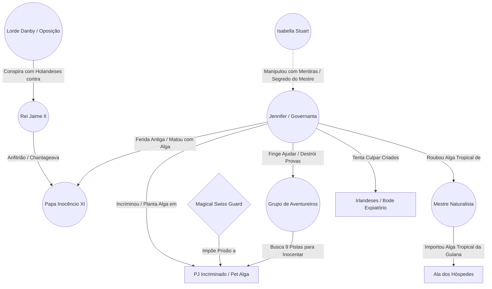

---
tags:
- projeto/rpg
- campanha/fabula-ultima
- status/producao
- tema/misterio-politico
- fabula-ultima/silencio-de-roma
sistema: Fabula Ultima
tipo: Episodio
relogio_julgamento: 0
relogio_incineracao: 0
---

# 📜 O Silêncio de Roma

> "Porque nada há encoberto que não haja de ser revelado; nem oculto que não haja de ser sabido." — Mateus 10:26

---

## 📜 Backstory (História de Fundo)

O Papa Inocêncio XI viajou a Londres em uma missão diplomática de altíssima tensão. A Inglaterra vive o estopim da crise religiosa e política da Revolução Gloriosa: o Rei Jaime II (católico) tenta impor um governo absolutista sobre um reino majoritariamente protestante. O Papa veio tentar conter os excessos autoritários do monarca para evitar uma guerra civil devastadora.

Durante o banquete real no Palácio de Whitehall, Inocêncio XI é encontrado morto em seus aposentos por asfixia provocada por uma alga marinha. Aproveitando-se do fato de um dos heróis possuir um companheiro/pet de alga, a culpa do assassinato é imediatamente plantada sobre o grupo por **Jennifer (a Governanta Real)**, a autora material do crime.

Jennifer carrega uma ferida antiga: décadas atrás, perdeu alguém querido numa perseguição religiosa entre católicos e protestantes, um ódio que nunca cicatrizou — só ficou dormente. O que ela não sabe é que essa dor foi encontrada e cultivada por alguém de fora, que a alimentou com mentiras cuidadosamente costuradas até convencê-la de que matar o Papa em solo inglês seria um ato de justiça. Jennifer age por convicção própria; ela não tem consciência de ser apenas uma peça de um jogo político muito maior. **(Segredo do Mestre: a verdadeira arquiteta é Isabela, que não aparece nesta sessão — ver seção "Segredo do Mestre" abaixo.)**

A grande virada para provar a inocência do grupo reside na investigação em camadas: provar que a alga é uma espécie tropical da Guiana (diferente da espécie de água fria do pet do PJ), rastrear sua origem até a Estufa Real e desmascarar o acesso e a falsa cooperação de Jennifer. Danby, Jaime II e o restante da corte têm motivos de sobra para querer o Papa morto — mas, nesta trama, são todos inocentes do crime em si.

---

## 📍 Como Chegar

- Convite Real por ter resolvido a crise da Torre de Robert Hooke
- Acompanhar a comitiva da Cúria Romana como escolta de honra
- Investigar a origem de Isabela Stuart

---

## 🎭 A Teia da Conspiração (Grafo de Relações)



---

## 🙎 NPCs & Suspeitos

- **Rei Jaime II** _(inocente do crime)_: Monarca absolutista. Quer abafar o crime rápido para não expor suas chantagens e documentos papais roubados.
- **Lorde Danby (Oposição Protestante)** _(inocente do crime)_: Nobre revoltoso. Quer usar a morte do Papa em solo inglês como pretexto para convocar Guilherme de Orange — mas não teve nenhuma participação no assassinato.
- **Mestre Naturalista da Corte** _(inocente do crime)_: Responsável pela Estufa Real. Foi quem importou o _Tanque de Conservação de Flora Tropical da Guiana_ (usado sem o seu conhecimento por Jennifer).
- **Cardeal Ottoboni** _(inocente do crime)_: Membro da comitiva papal, um dos favoritos (_papabile_) a suceder Inocêncio XI. Quer o corpo embarcado para Roma o mais rápido possível — não por decoro, mas porque quanto antes o conclave for convocado, maior a vantagem dele sobre rivais que ainda estão a caminho da Itália. Isso o coloca em rota de colisão direta com o grupo: cada cena gasta investigando é uma cena a menos antes do navio zarpar.
- **Jennifer (A Governanta Real / A Autora Material)** _(culpada)_: Solícita e carismática, finge ser a única que acredita na inocência do PJ e se oferece para "ajudar" o grupo na investigação. Carrega uma ferida religiosa antiga — perdeu alguém querido numa perseguição católica-protestante — e foi manipulada por um agente externo (ver Segredo do Mestre) que transformou essa dor em convicção de que matar o Papa era um ato de justiça. Ela usou a alga tropical da estufa para sufocar Inocêncio XI, plantou as provas no jogador e usa sua posição de "assistente" do grupo para destruir evidências e manipular a culpa em direção aos criados irlandeses. Ela age com convicção total — não se vê como vilã, e não vai se desculpar quando confrontada.

---

## 🎭 Trejeitos de Interpretação (Guia Rápido de Mesa)

_Aparência, trejeito físico, padrão de fala, quebra sob pressão e uma frase de abertura pra cada suspeito — cole esses ganchos e não precisa decorar personalidade inteira._

**Rei Jaime II ([[King James II]])**
![[James_II_art.png]]
- _Aparência:_ meia-idade avançada, postura ereta que exige esforço visível pra manter — como um homem carregando uma armadura invisível pesada demais. Olheiras mal escondidas por pó de arroz. Roupas ricas, mas escolhidas um tom mais escuras do que a moda pede, como se já estivesse de luto por algo que ainda não aconteceu.
- _Trejeito:_ gira um anel de sinete no dedo sem parar, mesmo quando está "calmo".
- _Fala:_ formal em excesso, frases longas cheias de títulos e cerimônia — até ser encurralado, quando as frases desmoronam em pedaços curtos e ríspidos.
- _Quebra sob pressão:_ para de girar o anel. Silêncio total por um segundo antes de explodir em autoridade ("Eu sou o rei desta terra!") — um homem mais assustado do que absolutista, na verdade.
- _Frase de abertura:_ "Vocês vieram resolver a Torre de Hooke com competência. Resolvam isto com a mesma... discrição."

**Lorde Danby**
![[Danby_art.png]]
- _Aparência:_ magro, quase febril de tanta energia contida — como se o corpo não conseguisse acompanhar a velocidade da própria cabeça. Roupas protestantes sóbrias, mas com um broche discreto demais pra ser modesto de verdade. Unhas roídas.
- _Trejeito:_ bate um rolo de pergaminho contra a palma da mão como se estivesse ensaiando um discurso o tempo todo.
- _Fala:_ retórica política mesmo em conversa casual — cita lei e precedente pra justificar qualquer opinião, até as mais banais.
- _Quebra sob pressão:_ perde o fio da retórica ensaiada e admite, por um instante, que está tão perdido quanto os PJs sobre quem matou o Papa — antes de se recompor e voltar ao discurso.
- _Frase de abertura:_ "Um Papa morto em solo inglês. Deus tem senso de oportunidade, não acham?"

**Mestre Naturalista da Corte**
![[Naturalist_art.png]]
- _Aparência:_ baixo, curvado de tanto se debruçar sobre canteiros, mãos grandes e ásperas cobertas de terra que nunca sai por completo das unhas. Óculos tortos, sempre um galho ou folha esquecido no bolso do avental.
- _Trejeito:_ fala com as mãos como se estivesse podando algo invisível.
- _Fala:_ nomes botânicos em latim escapam no meio das frases, mesmo quando ninguém entende — ele nem percebe que faz isso.
- _Quebra sob pressão:_ fica defensivo e quase ofendido quando a estufa é mencionada como cena de crime, como se a acusação fosse contra as próprias plantas, não contra ele.
- _Frase de abertura:_ "Minha estufa não mata ninguém sozinha. Alguém teve mãos lá dentro que não deveriam estar."

**Cardeal Ottoboni**

- _Aparência:_ corpulento de um jeito que parece deliberadamente confortável, vestes vermelhas impecáveis mesmo em meio ao caos do palácio — como se o luto real não tocasse a roupa dele. Sorriso pronto, olhos que nunca param de calcular por trás dele.
- _Trejeito:_ toca a cruz peitoral sempre que está calculando o próximo movimento — um tell que ele nem sabe que tem.
- _Fala:_ cadência medida, sorriso a meio caminho, nunca eleva a voz. Usa o silêncio como ferramenta de pressão — deixa a pergunta pairar até o outro ficar desconfortável.
- _Quebra sob pressão:_ a mão para na cruz peitoral e ele esquece de sorrir por um segundo — a ambição pura aparece, sem verniz, antes de ele perceber e reencenar a serenidade.
- _Frase de abertura:_ "Sua Santidade merece repousar em solo consagrado o quanto antes. Vocês entendem a urgência, certo?"

**Jennifer**
![[Jennifer_art.png]]
- _Aparência:_ impecável mesmo sob suspeita — avental sem uma mancha, cabelo preso com precisão militar. Mãos calejadas de décadas de trabalho, mas sempre firmes. Olhos claros que encaram sem desviar, o que desconcerta mais do que qualquer nervosismo desconcertaria.
- _Trejeito:_ mãos firmes mesmo sob acusação direta — calos de décadas de trabalho braçal, não de nervosismo.
- _Fala:_ precisa, nunca interrompe, deixa o outro terminar de falar antes de responder — quase gentil demais pra alguém tão perigosa.
- _Quebra sob pressão:_ não quebra. Esse é o ponto — ela é a única suspeita que não vacila sob pressão social, o que por si só deveria ser uma pista pros jogadores mais atentos.
- _Frase de abertura:_ "Ninguém aqui vai defender vocês além de mim. Deixem-me ajudar."

**Criado Irlandês (bode expiatório)**
![[Irish_art.png]]
- _Aparência:_ magro de trabalho duro, não de fome — mas as mãos contam a história de anos servindo em silêncio. Roupa remendada com cuidado, não com desleixo. Olhos baixos por hábito, não por culpa.
- _Trejeito:_ mãos calejadas de trabalho, olhos baixos por hábito de sobrevivência na corte, não por culpa.
- _Fala:_ sotaque forte, frases curtas — décadas de aprender que falar demais na frente da nobreza é perigoso.
- _Quebra sob pressão:_ quando finalmente alguém o trata com dignidade genuína (ver beat de graça na Cena 4), a voz falha por um segundo antes de recuperar a compostura — a primeira vez que alguém o vê como gente, não como suspeito conveniente.
- _Frase de abertura:_ "Não fui eu, senhor. Mas sei que vão dizer que fui, de qualquer jeito."

---

## 🔮 Segredo do Mestre — Gancho de Campanha

_(Não revelar diretamente aos jogadores nesta sessão.)_

A verdadeira arquiteta do assassinato é **Isabela**, que não aparece fisicamente nesta sessão. Ela identificou a ferida antiga de Jennifer e a alimentou com mentiras ao longo do tempo, convencendo-a de que a morte do Papa em solo inglês seria um ato justo — sem que Jennifer soubesse que estava sendo usada como peça de um plano maior ligado à disputa pela legitimidade de Isabela como possível filha bastarda de Carlos II.

Jennifer não conhece o nome verdadeiro de quem a manipulou — só um pseudônimo ou intermediário. Ao ser confrontada na Cena 4, ela pode soltar uma pista solta sem perceber a importância (uma frase repetida, um objeto, uma menção a "uma mulher que prometeu justiça"). Essa pista não precisa — e não deve — ser resolvida nesta sessão; ela só ganha sentido quando o grupo chegar a Londres para investigar a origem de Isabela.

---

## ⚙️ Painel do Mestre (Meta Bind)

### ⏳ Relógios da Sessão

**Julgamento Sumário do PJ:** ( `VIEW[{relogio_julgamento}]` / 8 )

```meta-bind
INPUT[slider(minValue(0), maxValue(8)):relogio_julgamento]
```

**Incineração / Selamento dos Vestígios:** ( `VIEW[{relogio_incineracao}]` / 6 )

```meta-bind
INPUT[slider(minValue(0), maxValue(6)):relogio_incineracao]
```

---

## 🕐 Detalhamento dos Relógios & Regras

### 1. Julgamento Sumário / Prisão (8 segmentos)

- Mede o tempo até a Guarda Real levar o PJ incriminado para a masmorra/forca.
- **Avanço:** Avança 1 segmento por falhas em testes de investigação, confrontos diretos sem provas ou sabotagens bem-sucedidas de Jennifer.
- **Se completar:** O _Magical Swiss Guard_ executa a prisão definitiva, forçando uma cena de fuga desesperada ou combate contra a guarda da corte.
- **Interrupção:** O relógio é pausado/anulado ao apresentar as evidências desmascarando a armação no julgamento.

---

### 2. Incineração / Selamento dos Vestígios (6 segmentos)

- Mede o tempo até o corpo do Papa ser lacrado e embarcado rumo a Roma.
- **Avanço:** Avança 1 segmento a cada cena em que o grupo não investigar diretamente a cena do crime ou o cadáver — **e mais 1 segmento adicional em qualquer cena em que o Cardeal Ottoboni consiga negociar diretamente com Jaime II sem oposição do grupo.** O Cardeal está correndo contra o próprio conclave: quanto antes o corpo zarpar, mais rápido a sucessão papal é convocada, e maior a vantagem dele sobre os rivais que ainda estão a caminho de Roma.
- **Se completar:** O corpo é lacrado em um sarcófago de chumbo para transporte a Roma, destruindo a pista física da alga e aumentando a dificuldade dos testes em +2.
- **Contenção:** os PJs podem gastar uma cena convencendo o Cardeal a esperar (teste social, DL 13) ou expondo publicamente sua ambição pessoal — o que resolve o problema, mas cria um inimigo poderoso e ressentido para mais tarde na campanha, caso ele de fato se torne Papa.

---

### 3. A Regra das 3 Pistas (3 Pistas por Conclusão Vital)

Para avançar na investigação e desmascarar a armação sem travar a mesa, cada verdade possui 3 caminhos independentes de descoberta. Cada pista tem uma **Dificuldade sugerida** e uma **Complicação** — nada de "rolou, achou": até no sucesso, o jogo empurra de volta. Falha nunca trava a investigação (sempre existe outro caminho pra mesma conclusão), mas custa caro — tempo, atenção de Jennifer, ou uma informação levemente distorcida que só aparece como mentira depois.

#### 🎯 Conclusão 1: A alga é TROPICAL (Inocenta a espécie do Pet do PJ)

- 🩺 **Pista 1.1 (Autópsia Botânica):** A alga na traqueia possui vesículas espessas e pigmentação avermelhada de água quente. 【AST + AST】 — _DL 10 (Médio)_. **Complicação:** o corpo já foi parcialmente preparado para o funeral — examinar de perto exige negociar acesso com o Cardeal Ottoboni ou agir às escondidas (se pego, ele passa a desconfiar do grupo).
- 📖 **Pista 1.2 (Compêndio da Biblioteca):** Livro de flora marítima indica que a espécie do crime só sobrevive acima de 24°C. 【AST + INT】 — _DL 10 (Médio)_. **Complicação clássica:** a página exata foi arrancada recentemente — clichê do "livro adulterado" — mas a marca de cola/poeira denuncia que foi arrancada há poucos dias, não décadas, o que já é uma pista extra sobre a pressa do culpado.
- 🧪 **Pista 1.3 (Análise da Jarra):** O pH do resíduo de água no quarto do Papa é idêntico ao de tanques equatoriais. 【AST + INT】 — _DL 13 (Difícil, requer kit ou conhecimento alquímico)_. **Complicação:** só existe um kit de análise no palácio, e ele está guardado na ala médica — que também serve de posto de vigia da Guarda Suíça.

#### 🎯 Conclusão 2: A alga veio da ESTUFA REAL (Origem da Arma)

- 🪴 **Pista 2.1 (O Tanque Violado):** O aquário de exóticos da estufa tem marcas de drenagem recente de mudas e água. 【AST + PER】 — _DL 10 (Médio)_. **Complicação:** Jennifer já está na estufa "organizando" quando o grupo chega — checagem vira um teste social simultâneo pra não levantar suspeita enquanto investiga.
- 🧹 **Pista 2.2 (Trapo de Cânhamo):** Pano de transporte molhado com alga tropical descartado no lixo de serviço. 【AST + PER】 — _DL 10 (Médio)_. **Complicação clássica:** perto do trapo real, há um segundo pano — este com alga de água **fria**, plantado por Jennifer como falso encerramento de caso (ver Red Herring "A Alga Fria Plantada" abaixo). Um sucesso simples pega o pano errado; só uma margem alta (ou uma segunda checagem) percebe que um dos dois foi cortado há poucas horas, não dias.
- 📜 **Pista 2.3 (Manifesto de Carga):** Documento no escritório prova que aquela alga era lote único importado para o palácio. 【AST + INT】 — _DL 13 (Difícil)_. **Complicação:** o escritório é do próprio Mestre Naturalista, que não vai gostar nem um pouco de ver documentos revirados sem permissão — mais uma corda social pra equilibrar.

#### 🎯 Conclusão 3: JENNIFER é a Culpada (Acesso, Tempo e Incriminação)

- 🔑 **Pista 3.1 (Controle de Chaves):** Apenas o Naturalista e Jennifer possuem chaves mestras da estufa e dos aposentos papais. 【AST + VON】 — _DL 10 (Médio)_. **Complicação:** o registro de chaves "sumiu" — Jennifer arrancou a página relevante. Achar a versão original exige interrogar o lacaio que faz a ronda noturna (testemunha nervosa, um clichê clássico, mas que aqui tem motivo genuíno pra ter medo: se descobrirem que ele viu algo, ele teme ser o próximo bode expiatório).
- 🧼 **Pista 3.2 (Perfume de Alfazema):** A jarra e o trapo do crime exalam o sabão barato que apenas Jennifer usa. 【AST + PER】 — _DL 13 (Difícil — detalhe sensorial sutil)_. **Complicação:** qualquer criada da ala de serviço usa um sabão parecido — a pista só fecha comparando o cheiro específico da jarra com o frasco pessoal de Jennifer, o que significa entrar no quarto dela sem ser flagrado.
- ⏳ **Pista 3.3 (Inconsistência de Horário):** O registro de serviço e o lacaio provam que Jennifer sumiu por 15 min antes do brinde e esteve no quarto do Papa. 【AST + VON】 — _DL 16 (Muito Difícil — é a pista decisiva)_. **Complicação:** Jennifer sabe que essa é a prova fatal e já tentou subornar o lacaio pra "esquecer" o horário. O teste vira um confronto social direto: convencer o lacaio a falar a verdade apesar do medo, ou pegá-lo em contradição.

---

## 🎭 Red Herrings Clássicos (opcional, use com moderação)

Dois desvios pra dar sabor de clássico sem virar caça ao tesouro de clichês:

- **A Alga Fria Plantada:** Jennifer deixa um segundo trapo com alga de água fria perto dos aposentos do PJ, tentando "fechar o caso" cedo demais contra o próprio grupo. Se os jogadores investigarem esse trapo com atenção (ou repetirem a Pista 2.2 com sucesso alto), percebem que foi cortado recentemente — vira uma pista extra que aponta direto pra sabotagem ativa de Jennifer, não pra resolução do caso.
- **O Bilhete Queimado:** Nas cinzas da lareira do Cardeal Ottoboni, meio-bilhete de amor/chantagem sugere um caso escondido dele com alguém da corte. É um beco sem saída pro assassinato — mas é ótimo combustível de roleplay (o Cardeal tenta esconder, mente descaradamente, e os jogadores podem gastar uma cena inteira nisso antes de perceber que não leva a lugar nenhum). Use só se a mesa estiver curtindo o ritmo de investigação e puder pagar o custo de tempo.

---

## 📄 Roteiro de Cenas

- **Cena 1 (O Banquete Real):**
    
    - Chegada a Whitehall e recepção por Jaime II.
    - Clima de tensão política entre protestantes e católicos.
    - Diálogo breve com o Papa Inocêncio XI e apresentação de Jennifer como a governanta prestativa.
- **Cena 2 (O Crime & A Incriminação):**
    
    - Descoberta do corpo com a alga na traqueia.
    - A Guarda Suíça cerca o local. Jennifer aparenta pânico e sugere sutilmente a alga do PJ, levando o grupo a ser incriminado.
    - Início dos relógios de Julgamento e Incineração.
- **Cena 3 (A Investigação & A Falsa Aliada):**
    
    - Jennifer se aproxima do grupo em custódia, alegando acreditar na inocência deles e oferecendo ajuda.
    - O grupo navega pelo palácio e interroga os suspeitos (Jaime II, Danby, Naturalista).
    - Jennifer tenta sabotar/limpar a estufa e direcionar a culpa do crime para os criados irlandeses.
    - Coleta das 9 Pistas distribuídas entre o corpo, a biblioteca, a estufa e as escalas de serviço.
- **Cena 4 (O Julgamento & Confronto):**
    
    - Apresentação das provas perante Jaime II e a nobreza.
    - Virada dramática: desmascarando a armação da alga tropical, o roubo da estufa e a culpa de Jennifer.
    - Jennifer confronta o grupo com convicção total, sem remorso — e, sem perceber a importância, solta a pista solta sobre quem a manipulou (ver Segredo do Mestre).
    - Jennifer tenta acionar suas salvaguardas ou o pânico na câmara gera o combate tático.
    - Combate contra o _Magical Swiss Guard_ e a guarda real.
- **Cena 5 (Conclusão & Consequências):**
    
    - Inocência do PJ provada e Jennifer responsabilizada pelo regicídio.
    - O escândalo quebra a legitimidade de Jaime II, acelerando os eventos da Revolução Gloriosa.

---

---

## 🎬 Monólogo de Confronto — Jennifer (Cena 4)

_Nota do Mestre: use este texto (ou parafraseie) no momento em que a Pista 3.3 (Inconsistência de Horário) for apresentada e Jennifer perceber que não há mais como negar. Ela não implora, não chora, não se desculpa — ela explica, com a calma de quem já fez as pazes com o próprio crime há muito tempo._

> "Vocês acham que descobriram algo. Um horário. Um cheiro de sabão. Acham que desmontaram um crime, peça por peça, como quem resolve um quebra-cabeça de salão.
> 
> Não desmontaram nada. Vocês só chegaram tarde a uma dívida que tem trinta e dois anos.
> 
> [_Nota do Mestre: aqui ela nomeia, com precisão fria, quem perdeu — preencha com o detalhe que fizer sentido pra sua mesa: um nome, um lugar, uma data de um massacre religioso da época._] Ninguém pediu desculpas então. Ninguém veio com relógios e testes de percepção atrás de justiça pra mim. Eu não precisei de investigadores — precisei de vinte anos calada, servindo chá pra gente que ria enquanto o mundo delas continuava girando.
> 
> Alguém, uma vez, me disse que até a paciência de Deus tem limite — mesmo pros homens que se dizem vigários Dele na terra. Não lembro o rosto de quem falou isso. Só lembro que, pela primeira vez em vinte anos, alguém _me_ enxergou. E que era verdade."

**Gancho plantado:** a frase "_alguém, uma vez, me disse_" é a Pista Secreta sobre Isabela — Jennifer não sabe (e não vai revelar, porque não sabe) quem é essa pessoa. Se os PJs perguntarem diretamente, ela só repete: _"Uma sombra gentil. Isso basta."_ Guarde essa frase — ela volta a fazer sentido em Londres.

**Beat opcional de graça (use se a mesa estiver no clima certo):** se um dos criados irlandeses que Jennifer tentou incriminar estiver na sala, ele pode dar um passo à frente e dizer algo simples e genuíno — não um perdão barato, mas uma recusa em odiá-la de volta ("Não vou rezar pela sua alma porque me pediram. Vou rezar porque é a única coisa que ainda é minha pra dar."). Jennifer pode vacilar por um instante — um piscar de olhos, um silêncio maior que o normal — antes de recompor a máscara de convicção e seguir para a prisão sem mais uma palavra. Não force reação nenhuma dela além disso: ela não se redime nesta sessão. A luz aqui é do criado, não dela.

---

## 🧌 Adversários & Banco de Dados (Dataview)

```dataview
TABLE nivel AS "Nível", rank AS "Rank", hp_max AS "PV Máx"
FROM #fabula-ultima/silencio-de-roma OR #fabula-ultima/revolucao-gloriosa
WHERE nivel != null AND file.name != "Rascunho"
SORT nivel DESC
```

- **King Jaime II** (Vilão Maior / Campeão 4 / Sabotador)
- **Magical Swiss** (Soldado / Suporte Arcano)
- **Swiss Guard** (Soldado / Vanguarda)
- **Royal Guard** (Soldado / Controle)