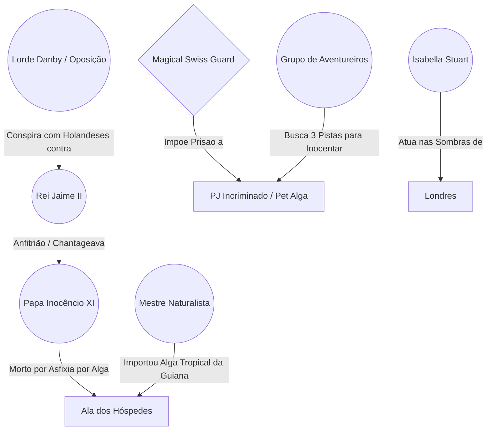

---
tags:
  - projeto/rpg
  - campanha/fabula-ultima
  - status/producao
  - tema/misterio-politico
  - fabula-ultima/silencio-de-roma
sistema: Fabula Ultima
tipo: Episodio
relogio_julgamento: 0
relogio_incineracao: 0
relogio_atitude_corte: 3
relogio_estufa: 0
---

# 📜 O Silêncio de Roma
> "Porque nada há encoberto que não haja de ser revelado; nem oculto que não haja de ser sabido." — Mateus 10:26

---

## 📜 Backstory (História de Fundo)
O Papa Inocêncio XI viajou a Londres em uma missão diplomática de altíssima tensão. A Inglaterra vive o estopim da crise religiosa e política da Revolução Gloriosa: o Rei Jaime II (católico) tenta impor um governo absolutista sobre um reino majoritariamente protestante. O Papa veio tentar conter os excessos autoritários do monarca para evitar uma guerra civil devastadora.

Durante o banquete real no Palácio de Whitehall, Inocêncio XI é encontrado morto em seus aposentos por asfixia provocada por uma alga marinha. Aproveitando-se do fato de um dos heróis possuir um companheiro/pet de alga, a culpa do assassinato é imediatamente plantada sobre o grupo para servir de bode expiatório e abafar o verdadeiro escândalo. A grande virada para provar a inocência reside na diferença botânica: o pet do jogador é de uma espécie de água fria/costeira da Grã-Bretanha, enquanto a alga usada no crime é uma espécie tropical vinda da Guiana.

---

## 📍 Como Chegar
* Convite Real por ter resolvido a crise da Torre de Robert Hooke
* Convocação diplomática da Guarda Real para o banquete
* Acompanhar a comitiva da Curia Romana como escolta de honra

---

## 🎭 A Teia da Conspiração (Grafo de Relações)


---

## 🙎 NPCs & Suspeitos
* **Rei Jaime II:** Monarca absolutista. Quer abafar o crime rápido para não expor suas chantagens e documentos papais roubados.
* **Lorde Danby (Oposição Protestante):** Nobre revoltoso. Quer usar a morte do Papa em solo inglês como pretexto para convocar Guilherme de Orange.
* **Mestre Naturalista da Corte:** Responsável pela Estufa Real. Foi quem importou o *Tanque de Conservação de Flora Tropical da Guiana*.
* **Cardeal Comissário:** Membro da comitiva papal com rivalidades internas e disputas de poder na Curia.

---

## ⚙️ Painel do Mestre (Meta Bind)

### ⏳ Relógios da Sessão

**Julgamento Sumário do PJ:** ( `VIEW[{relogio_julgamento}]` / 8 )
```meta-bind
INPUT[slider(minValue(0), maxValue(8)):relogio_julgamento]
```

**Incineração / Selamento dos Vestígios:** ( `VIEW[{relogio_incineracao}]` / 6 )
```meta-bind
INPUT[slider(minValue(0), maxValue(6)):relogio_incineracao]
```

**Atitude da Corte Real:** ( `VIEW[{relogio_atitude_corte}]` / 6 )
```meta-bind
INPUT[slider(minValue(0), maxValue(6)):relogio_atitude_corte]
```

**Investigação da Estufa Real:** ( `VIEW[{relogio_estufa}]` / 4 )
```meta-bind
INPUT[slider(minValue(0), maxValue(4)):relogio_estufa]
```

---

## 🕐 Detalhamento dos Relógios & Regras

### 1. Julgamento Sumário / Prisão (8 segmentos)
* Mede o tempo até a Guarda Real levar o PJ incriminado para a masmorra/forca.
* **Avanço:** Avança 1 segmento por falhas em testes de investigação, confrontos diretos sem provas ou perda de tempo.
* **Se completar:** O *Magical Swiss Guard* executa a prisão definitiva, forçando uma cena de fuga desesperada ou combate contra a guarda da corte.
* **Interrupção:** O relógio é pausado/anulado ao apresentar as 3 Pistas Botânicas na Câmara das Estrelas.

---

### 2. Incineração / Selamento dos Vestígios (6 segmentos)
* Mede o tempo até Jaime II selar o corpo do Papa para conter o escândalo.
* **Avanço:** Avança 1 segmento a cada cena em que o grupo não investigar diretamente a cena do crime ou o cadáver.
* **Se completar:** O corpo é lacrado em um sarcófago de chumbo para transporte a Roma, destruindo a pista física da alga e aumentando a dificuldade dos testes em +2.

---

### 3. A Regra das 3 Pistas (A Virada Botânica)
Para provar a inocência do jogador, o grupo precisa coletar estas 3 evidências:
1. 🩺 **Pista 1 (Física - O Corpo):** A alga na garganta do Papa é avermelhada e espessa (tropical). O pet do jogador é verde-oliva e de água fria. Teste de 【AST + AST】.
2. 🗣️ **Pista 2 (Testemunho - O Lacaio):** Depoimento do lacaio que carregou água salgada aquecida para a estufa na tarde do crime. Teste de 【AST + VON】.
3. 📜 **Pista 3 (Documento - O Manifesto):** Registro de remessa do *"Tanque da Guiana"* no escritório do palácio. Teste de 【AST + INT】.

---

## 📄 Roteiro de Cenas

* **Cena 1 (O Banquete Real):**
  * Chegada a Whitehall e recepção por Jaime II.
  * Clima de tensão política entre protestantes e católicos.
  * Diálogo breve com o Papa Inocêncio XI.

* **Cena 2 (O Crime & A Incriminação):**
  * Descoberta do corpo com a alga na traqueia.
  * A Guarda Suíça cerca o local e culpa o PJ.
  * Início dos relógios de Julgamento e Incineração.

* **Cena 3 (A Investigação):**
  * Navegação discreta pelo palácio sob custódia/vigilância.
  * Interrogatório dos suspeitos (Jaime II, Danby, Naturalista).
  * Coleta das 3 Pistas Botânicas na cena do crime, na estufa e nos registros.

* **Cena 4 (O Julgamento & Confronto):**
  * Apresentação das provas perante Jaime II e a nobreza.
  * Revelação do verdadeiro culpado e tentativa de eliminação/combate tático.
  * Combate contra o *Magical Swiss Guard* e a guarda real.

* **Cena 5 (Conclusão & Consequências):**
  * Inocência do PJ provada.
  * O escândalo quebra a legitimidade de Jaime II, acelerando a Revolução Gloriosa.

---

## 🧌 Adversários & Banco de Dados (Dataview)

```dataview
TABLE nivel AS "Nível", rank AS "Rank", hp_max AS "PV Máx"
FROM #fabula-ultima/silencio-de-roma OR #fabula-ultima/revolucao-gloriosa
WHERE nivel != null AND file.name != "Rascunho"
SORT nivel DESC
```

* **King Jaime II** (Vilão Maior / Campeão 4 / Sabotador)
* **Magical Swiss** (Soldado / Suporte Arcano)
* **Swiss Guard** (Soldado / Vanguarda)
* **Royal Guard** (Soldado / Controle)