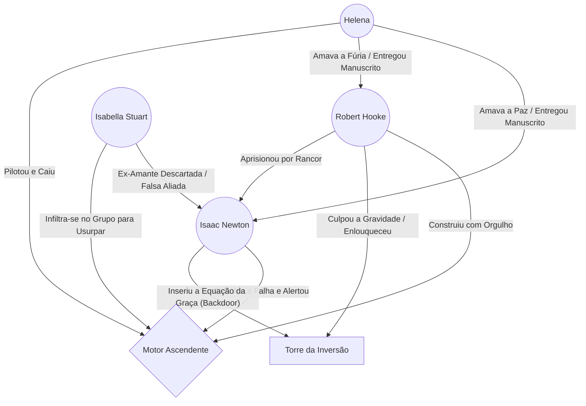

---
tags:
  - projeto/rpg
  - campanha/fabula-ultima
  - status/producao
  - tema/realismo-poetico
sistema: Fabula Ultima
tipo: One-Shot
relogio_colapso: 0
relogio_hooke: 0
relogio_labirintite: 0
---
# 🍎 O Peso da Verdade: A Torre Invertida

> *"O metal vai ceder. O peso vai reclamar o que é dele. A lei não se curva à nossa vontade, Robert."* — [[Isaac Newton]]

## 📜 Logline e Atmosfera

Um grupo de heróis chega a [[Vila de Queda-Livre]], um lugar onde a própria estrutura da realidade está sangrando: ==pássaros são esmagados no chão== e ==ovelhas flutuam em direção às nuvens==. Eles precisam descer (subindo) a [[Torre da Inversão]] para impedir [[Robert Hooke]], um homem quebrado, de destruir as leis da Criação para apagar sua própria culpa pela morte de [[Helena]]. O que eles não sabem é que a expedição carrega seu próprio veneno: velhos rancores políticos e uma aliada disposta a usurpar o trono do apocalipse.

---

## 🎭 A Teia da Tragédia (Grafo de Relações)

*O Triângulo fraturado pelo orgulho, pela dor e pela vingança, mapeado via `mermaid-tools`.*



---

## 🏘️ O Hub do Desespero: Vila de Queda-Livre
Antes de mergulhar na anomalia, o grupo deve sobreviver à miséria daqueles que ficaram para trás. Use estes NPCs para estabelecer o tom visceral e arrancar os primeiros recursos e emoções dos heróis:

* **O Peso da Resistência:** [[Silas]] (o pastor enterrado na lama), [[Thomas]] (o sheriff de chumbo) e [[Kael]] (o taverneiro pragmático e amargurado).
* **A Fé e a Mente Fraturadas:** [[Elara]] (a aprendiz traumatizada acorrentada à bigorna), [[Reverendo Samuel]] (o pastor de ponta-cabeça) e [[Alaric]] (o burocrata enlouquecido).
* **Os Oportunistas do Caos:** [[Seu Tião]] (vendendo pastel frito no vácuo), [[Zé da Corda]] (cobrando pedágio de âncora) e [[Balthazar]] (o mascate que forneceu os manuais da tragédia).
* **A Anomalia Inexplicável:** [[Caramelo]], o vira-lata que caminha pela gravidade nula como se nada estivesse acontecendo.
* **A Adaga Oculta:** [[Isabella]], a nobre bastarda que guia o grupo com doçura, esperando o momento de trair a todos por poder.

---

## ⚙️ Painel do Mestre (Meta Bind + Dice Roller)

Controle o caos gravitacional e o avanço dos perigos sem sair desta página.

### ⏳ Relógios de Perigo

*Altere o slider no modo Live Preview para preencher os relógios.*

- **Colapso Gravitacional da Torre:** ( `VIEW[{relogio_colapso}]` / 6 )
  `INPUT[slider(minValue(0), maxValue(6)):relogio_colapso]`

- **O Desespero de Hooke:** ( `VIEW[{relogio_hooke}]` / 4 )
  `INPUT[slider(minValue(0), maxValue(4)):relogio_hooke]`
- - **Labirintite Global:** ( `VIEW[{relogio_labirintite}]` / 6 ) `INPUT[slider(minValue(0), maxValue(6)):relogio_labirintite]`

### 🎲 Anomalias da Sala
*Clique no dado quando o grupo entrar numa nova sala da Torre:* `dice: 1d6`

| 🎲 | Anomalia | A Tela (Narrativa) | O Preço (Mecânica) |
| :---: | :--- | :--- | :--- |
| **1** | **Pés de Chumbo** | A gravidade se agarra aos calcanhares como lama magnética. | Todos sofrem **Lento** (reduz o dado de DES) até saírem ou quebrarem o maquinário. |
| **2** | **Falta de Atrito** | O chão perde a aderência. Balançar uma lâmina joga você para trás. | **-2 em Precisão** corpo a corpo. *As Leis da Inércia se aplicam.* |
| **3** | **Chuva Invertida** | Estilhaços de vidro e ferrugem disparam do chão ao céu, rasgando a pele. | Teste **【DES + DES】 (Dif 10)**. Falha: 10 (Fraco) ou 30 (Forte) de dano físico. |
| **4** | **Vácuo Parcial** | Suga o oxigênio; a menor corrente de ar vira uma lâmina invisível. | **Vulnerabilidade a Ar** (dobro do dano), a menos que imune/absorvedor. |
| **5** | **Gravidade Nula** | Chão e teto perdem o significado. O estômago embrulha no vazio. | Teste **【DES + VON】 (Dif 10)**. Falha: **Atordoado** + 1 seção do Relógio *Labirintite* (2 seções se falhar por 3+). *As Leis da Inércia se aplicam.* |
| **6** | **Esmagamento** | A gravidade dobra abruptamente. Os ossos estalam sob o peso do Arquiteto. | Teste brutal **【VIG + VIG】 (Dif 10)**. Falha: 30 de dano físico direto (Crise). |

> [!warning] ⚙️ As Leis da Inércia (Regras Especiais para Salas 2 e 5)
> Sempre que a sala apresentar **Falta de Atrito (2)** ou **Gravidade Nula (5)**, a movimentação exige um sacrifício cruel:
> * **O Preço do Impulso (Ataques Corpo a Corpo):** Para conseguir impulso, o atacante deve gastar **1 Ponto de Inventário (PI)** antes do ataque (arremessando um frasco ou sucata na direção oposta) OU gastar uma ação menor para se desfazer de um item pesado na narrativa (usando a 3ª Lei de Newton).
> * **O Coice da Pólvora (Ataques à Distância):** Armas de fogo e feitiços funcionam, mas o recuo no vácuo é impiedoso. O atirador é arremessado para longe e **perde imediatamente** qualquer benefício de cobertura concedido por aliados usando *Guarda*.

> [!bug] 🤢 O Preço do Caos: Labirintite e Dramina
> O corpo humano não foi feito para ser dobrado junto com o espaço. Acompanhe a vertigem do grupo usando o Relógio de Labirintite Global no Painel do Mestre:
> `INPUT[slider(minValue(0), maxValue(6)):relogio_labirintite]`
> 
> **🌀 Efeitos do Enjoo Gravitacional**
> * **Estágio 1 - Suor Frio (3/6):** A vertigem bate, minando o espírito. O grupo recebe a condição **Abalado** (o dado de VON cai um passo temporariamente).
> * **Estágio 2 - Colapso Gástrico (6/6):** O estômago vence a gravidade. A condição se agrava para **Lento** (o dado de DES cai um passo). Durante um combate, um personagem deve gastar sua Ação Principal fazendo a ação de *Objetivo* para "limpar o sistema" (vomitar). Lutar e conjurar ignorando a ânsia custa caro: toda ação principal realizada sem se limpar faz o herói perder **20 PM instantaneamente** por exaustão física e mental.
>
> **🧪 Item de Improviso: Tintura de Dramina**
> *Uma poção alquímica espessa e amarga, com cheiro de raiz-pesada e ferrugem, criada nos porões de Woolsthorpe.*
> * **Custo:** 2 PI (Pontos de Inventário) e o uso da ação *Inventário* em combate para consumir.
> * **O Alívio:** O herói zera instantaneamente o seu acúmulo no Relógio de Labirintite e se cura das condições Abalado e Lento.
> * **O Preço (Efeito Colateral):** O alívio químico amortece a mente. O usuário sofre imediatamente a condição **Atordoado** (o dado de AST cai um passo) devido à sonolência severa.
> * **Overdose (Estado Narrativo):** Ingerir uma segunda dose enquanto já estiver Atordoado força o corpo a desligar. O personagem cai no estado narrativo **Dormindo/Inconsciente** por 1 rodada completa, incapaz de agir até tomar dano ou ser sacudido.

> [!success] 🕊️ A Equação da Graça (O Uso de Pontos de Fabula)
> O peso da Lei pode ser anulado. Se os heróis tiverem os Cálculos de Galileu ou a aliança de Newton, eles descobriram a "Equação da Graça" — um "backdoor" no código do universo de Hooke.
> * **Como usar:** Um jogador pode gastar **1 Ponto de Fabula**  para invocar o Tema da Esperança ou a ajuda de Newton.
> * **O Efeito:** A Graça apaga a dívida da física. A anomalia atual é **instantaneamente desativada**, a sala retorna à gravidade normal e o Motor Ascendente falha por 1 rodada.
---


### 🍏 Ação de Suporte: As Três Leis de Newton (NPC Auxiliar)
Enquanto Newton estiver protegido pelo grupo, ele pode usar seu turno de NPC para manipular a física a favor dos heróis:
1. **Conservação de Momento (Ataque):** Newton calcula a parábola perfeita. O próximo ataque físico de um herói ganha **+5 de dano adicional**, e esse dano ganha penetração (ignora Resistências físicas).
2. **Cálculo Infinitesimal (Defesa):** Ele prevê a trajetória inimiga através de derivadas. Um herói alvo ganha **+2 na Defesa e Defesa Mágica** até o fim da rodada.
3. **Ação e Reação (Repulsão Cinética):** Newton prepara uma armadilha matemática. Escolha um herói; se esse herói sofrer um ataque corpo a corpo nesta rodada, a energia cinética é devolvida. O herói ganha **Resistência a dano Físico** contra esse golpe, e o atacante sofre **10 pontos de dano Físico automático** pelo coice da própria força.

## 🗃️ Banco de Dados da Aventura (Dataview)

*Estas tabelas puxam automaticamente as fichas criadas com as tags do projeto.*

### 🗣️ NPCs e Vínculos (Vila e Torre)

```dataview
TABLE tipo, status, localização
FROM #npc AND (#fabula-ultima/torre-invertida OR #fabula-ultima/queda-livre)
SORT file.name ASC
```

### 👾 Bestiário e Ameaças

```dataview
TABLE nivel, fraqueza, hp_max
FROM #monstro AND (#fabula-ultima/torre-invertida OR #fabula-ultima/queda-livre)
SORT nivel DESC
```

### 🛡️ Heróis e Aventureiros (Guilda dos Bigodudos)
```dataview
TABLE nivel AS "Nível", classes AS "Classes", tipo AS "Tipo"
FROM #personagem-jogador AND (#fabula-ultima/torre-invertida OR #fabula-ultima/queda-livre)
SORT file.name ASC
```

### 🗺️ Plantas e Rascunhos (Excalidraw)

*Links rápidos para os seus desenhos esquemáticos da masmorra.*

- [[Planta_Andar_1.excalidraw|O Teto do Saguão (Entrada)]]
- [[Prisao_de_Newton.excalidraw|A Cela Estática (Andar 2)]]
- [[Planetario_Quebrado.excalidraw|O Falso Éden (Topo/Fundo da Torre)]]