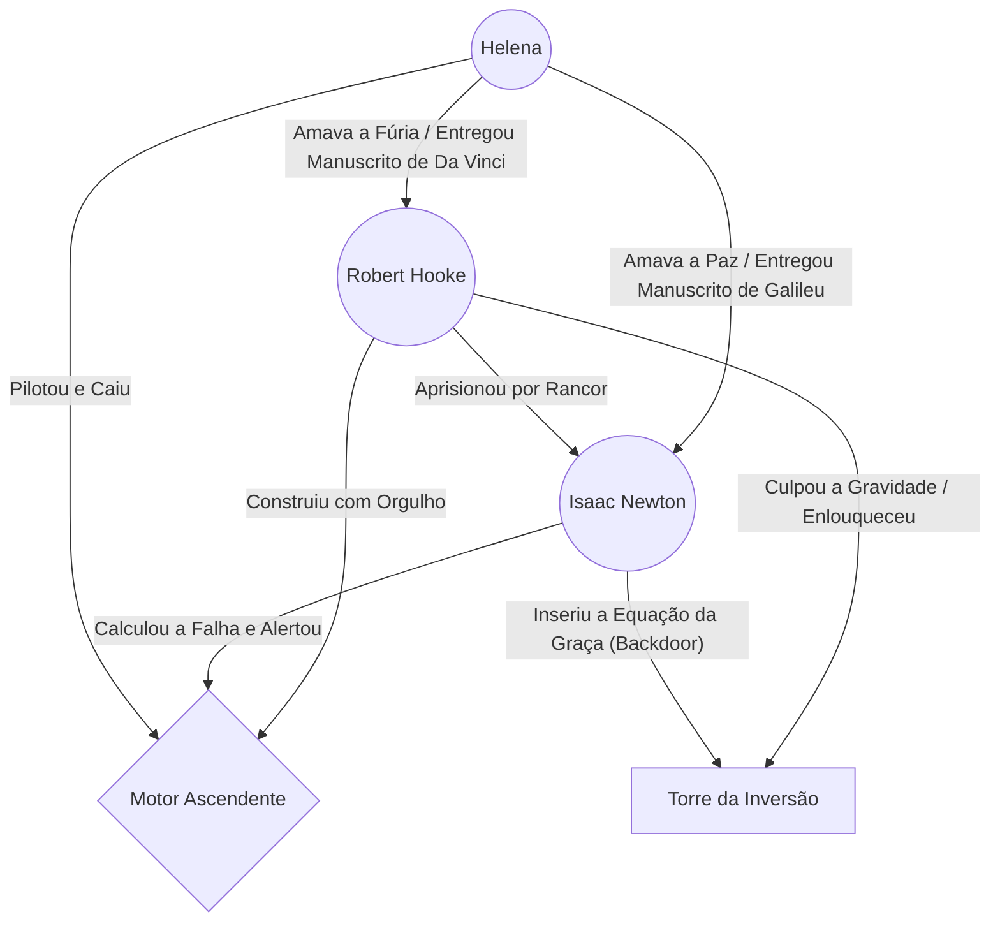

---
tags:
  - campanha/fabula-ultima
  - status/pre-producao
  - tema/realismo-poetico
sistema: Fabula Ultima
tipo: One-Shot
relogio_colapso: 0
relogio_hooke: 0
---
# 🍎 O Peso da Verdade: A Torre Invertida

> *"O metal vai ceder. O peso vai reclamar o que é dele. A lei não se curva à nossa vontade, Robert."* — [[Isaac Newton]]

## 📜 Logline e Atmosfera
Um grupo de heróis chega a [[Vila de Queda-Livre]], um lugar onde a própria estrutura da realidade está sangrando: ==pássaros são esmagados no chão== e ==ovelhas flutuam em direção às nuvens==. Eles precisam descer (subindo) a [[Torre da Inversão]] para impedir [[Robert Hooke]], um homem quebrado, de destruir as leis da Criação para apagar sua própria culpa pela morte de [[Helena]].

---

## 🎭 A Teia da Tragédia (Grafo de Relações)
*O Triângulo fraturado pelo orgulho e pela dor, mapeado via `mermaid-tools`.*



---

## ⚙️ Painel do Mestre (Meta Bind + Dice Roller)
Controle o caos gravitacional e o avanço dos perigos sem sair desta página.

### ⏳ Relógios de Perigo
*Altere o slider no modo Live Preview para preencher os relógios.*

- **Colapso Gravitacional da Torre:** ( `VIEW[{relogio_colapso}]` / 6 )
  `INPUT[slider(minValue(0), maxValue(6)):relogio_colapso]`

- **O Desespero de Hooke:** ( `VIEW[{relogio_hooke}]` / 4 )
  `INPUT[slider(minValue(0), maxValue(4)):relogio_hooke]`

### 🎲 Anomalias da Sala (Role 1d6)
*Clique no dado do `obsidian-dice-roller` quando o grupo entrar numa nova sala.*
**Role aqui:** `dice: 1d6`
1. **Pés de Chumbo:** Todos recebem o status *Lento*.
2. **Falta de Atrito:** Ataques corpo a corpo sofrem desvantagem.
3. **Chuva Invertida:** Estilhaços de vidro caem do chão para o teto.
4. **Vácuo Parcial:** Dano de vento/ar é maximizado.
5. **Gravidade Nula:** Teste de `Agilidade + Vontade` para não ficar flutuando à deriva.
6. **Esmagamento:** A gravidade dobra. Personagens frágeis sofrem dano de Crise.

---

## 🗃️ Banco de Dados da Aventura (Dataview)
*Estas tabelas vão se auto-preencher conforme você cria os arquivos dentro da pasta do One Shot e coloca as tags corretas.*

### 🗣️ NPCs e Vínculos
```dataview
TABLE tipo, status, localização
FROM #npc AND "Campanhas/Torre_Invertida"
SORT file.name ASC
```

### 👾 Bestiário e Aberrações de Da Vinci
```dataview
TABLE nivel, fraqueza, hp_max
FROM #monstro AND "Campanhas/Torre_Invertida"
SORT nivel DESC
```

### 🗺️ Plantas e Rascunhos (Excalidraw)
*Links rápidos para os seus desenhos esquemáticos da masmorra criados com o `obsidian-excalidraw-plugin`.*
- [[Planta_Andar_1.excalidraw|O Teto do Saguão (Entrada)]]
- [[Prisao_de_Newton.excalidraw|A Cela Estática (Andar 2)]]
- [[Planetario_Quebrado.excalidraw|O Falso Éden (Topo/Fundo da Torre)]]