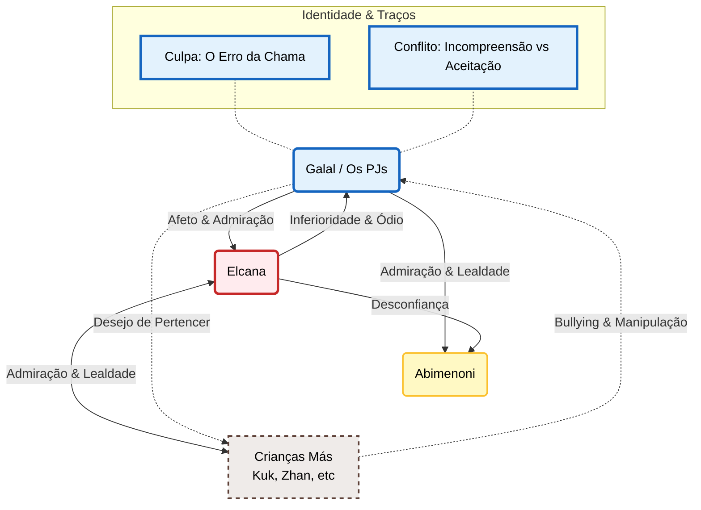

# Rede de Relacionamentos: O Prólogo

## 🕸️ O Mapa Social (Capítulos 1-4)

```mermaid
flowchart TD
    classDef protagonista fill:#e3f2fd,stroke:#1565c0,stroke-width:3px,color:#000;
    classDef rival fill:#ffebee,stroke:#c62828,stroke-width:3px,color:#000;
    classDef mentor fill:#fff9c4,stroke:#fbc02d,stroke-width:2px,color:#000;
    classDef grupo fill:#efebe9,stroke:#5d4037,stroke-width:2px,stroke-dasharray: 5 5,color:#000;

    G(Galal / Os PJs):::protagonista
    E(Elcana):::rival
    A(Abimenoni):::mentor
    C[Crianças Más\nKuk, Zhan, etc]:::grupo

    subgraph Traços [Identidade & Traços]
        direction TB
        T1[Culpa: O Erro da Chama]:::protagonista
        T2[Conflito: Incompreensão vs Aceitação]:::protagonista
    end
    T1 -.- G
    T2 -.- G

    G -->|Afeto & Admiração| E
    E -->|Inferioridade & Ódio| G
    G -->|Admiração & Lealdade| A
    E -->|Desconfiança| A
    E <-->|Admiração & Lealdade| C
    C -.->|Bullying & Manipulação| G
    G -.->|Desejo de Pertencer| C
    A ~~~ C
```