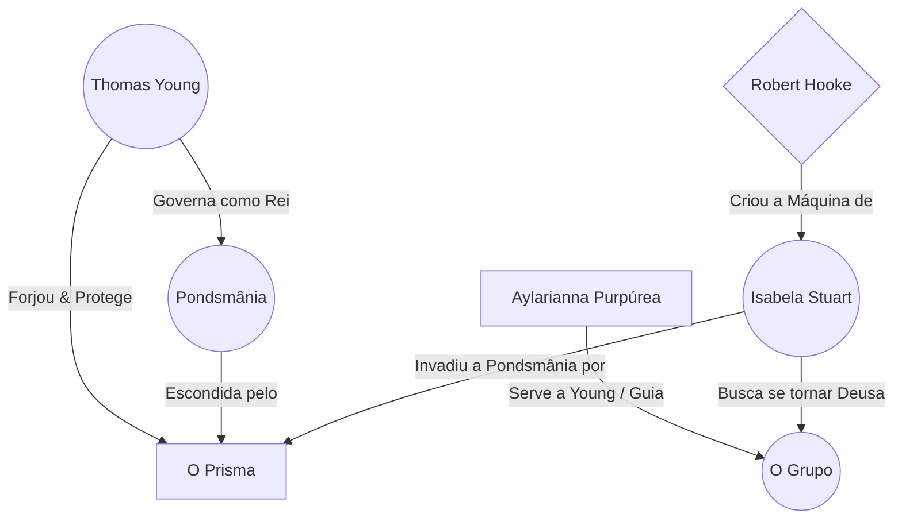
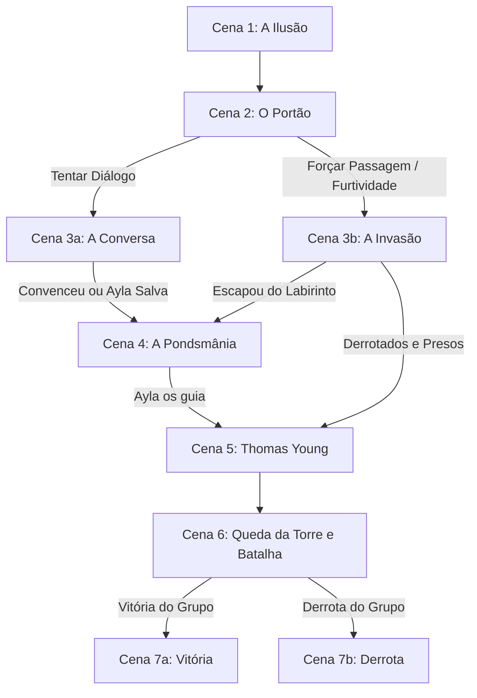

---
tags:
  - projeto/rpg
  - campanha/fabula-ultima
  - status/producao
  - tema/realismo-poetico
  - fabula-ultima/young-illusion
sistema: Fabula Ultima
tipo: Episodio
relogio_convencimento: 0
relogio_fuga: 0
relogio_isabela: 0
---

# 🧚‍♂️ A Ilusão Feérica de Young
> "A luz resplandece nas trevas, e as trevas não a compreenderam." — João 1:5

![[stonehenge_pixel_art_v1.png]]
![[underground_fairy_city_pixel_art_v2.png]]
---

## 📜 Backstory (História de Fundo)
Thomas Young era um homem da ciência que tropeçou na magia. Vagando pelo mundo frio e implacável dos homens, ele foi atraído por uma pegadinha feérica no Stonehenge e descobriu a Pondsmânia, a cidade oculta das criaturas mágicas. Maravilhado com o que viu — um mundo sujo, caótico, mas incrivelmente belo —, ele usou sua genialidade acadêmica e a magia local para forjar **O Prisma**, uma relíquia capaz de dobrar a luz e esconder completamente a cidade da ganância humana. As fadas, gratas, o fizeram seu Rei.

No entanto, a ganância sempre encontra um caminho. Meses atrás, Robert Hooke tentou coagir Young a entregar o Prisma para sua máquina profana. Young recusou. Agora, o silêncio da noite enevoada foi quebrado por **Isabela Stuart**. Usando a armadura e o terrível Núcleo do Motor Ascendente de Hooke, ela invadiu a Pondsmânia. Ela não busca apenas magia; ela quer o Prisma para fundir as leis da ótica e da gravidade, visando ascender como uma "deusa" sob um mundo quebrado, esmagando-o com seu próprio peso.

---

## 📍 Como Chegar
* O grupo viaja durante a noite e faz uma parada obrigatória no Stonehenge.
* O local está imerso em uma névoa espessa, fria e palpável. O som de folhas sussurrando, o arrepio de ser observado e sombras dançando na visão periférica anunciam que o véu da realidade está fino.

---

## 🎭 A Teia da Conspiração (Grafo de Relações)


---

## 🙎 NPCs & Sobreviventes
* **Rei Feérico (Thomas Young):** Um homem outrora exausto da vida acadêmica, agora vestindo um jaleco branco sujo sobre trajes feéricos. Ele é a ponte entre a razão humana e a loucura mágica. Tem um olhar sábio e cansado, mas que reflete a luz da graça que ele encontrou naquele povo.
* **Aylarianna (Ayla) Purpúrea:** Uma fada de cabelos rosas, caótica, agitada e mentirosa compulsiva, mas de coração bom. Suas mentiras não são por maldade, mas pela natureza desconexa das fadas. Ela é o caos que salva.
* **Isabela Stuart:** Outrora humana, agora uma guerreira coberta pela poeira da sua própria ambição. Sua armadura é pesada, a maquiagem escura escorre pelos olhos injetados pela energia do Motor Ascendente. Ela é a força bruta querendo subjugar a Criação.

---

## ⚙️ Painel do Mestre (Meta Bind)

### ⏳ Relógios da Sessão

**Convencimento dos Guardas:** ( `VIEW[{relogio_convencimento}]` / 4 )
```meta-bind
INPUT[slider(minValue(0), maxValue(4)):relogio_convencimento]
```

**Fuga do Labirinto da Pondsmânia:** ( `VIEW[{relogio_fuga}]` / 6 )
```meta-bind
INPUT[slider(minValue(0), maxValue(6)):relogio_fuga]
```

**Ascensão da Deusa da Gravidade (Isabela):** ( `VIEW[{relogio_isabela}]` / 4 )
*Nota: Avance este relógio cada vez que ela conseguir absorver uma Relíquia durante o combate.*
```meta-bind
INPUT[slider(minValue(0), maxValue(4)):relogio_isabela]
```

---

## 🕐 Detalhamento dos Relógios & Regras

### 1. Convencimento dos Guardas (4 segmentos)
* **Objetivo:** Persuadir os guardas (gigantes ilusórios) no portão a deixar o grupo entrar pacificamente.
* **Modificadores Sociais:**
  * Citar a intenção de salvar Thomas Young: **+1 segmento**.
  * Citar aliança com Isaac Newton: **+1 segmento automático**.
  * Citar intenção de impedir Isabela: **+1 segmento**.
  * Falar de Robert Hooke (sem deixar claro imediato que o odeiam): **-1 segmento (recuo)**.
* **Resolução (Sucesso):** Se preencherem o relógio, os guardas ficam convencidos da índole do grupo, mas a burocracia feérica ainda exige um salvo-conduto. Nesse exato momento, Ayla surge com os "papéis" e eles são liberados.
* **Resolução (Falha - Fail Forward):** Se falharem mais de 5 vezes em testes sociais e os guardas tentarem expulsá-los, Ayla surge interceptando a confusão, batendo na mesa com sua pilha de notas fiscais de pizza e santinhos de político (que a magia de ilusão faz os guardas lerem como um passe diplomático).

### 2. Fuga do Labirinto (6 segmentos)
* **Objetivo:** Escapar do batalhão nas ruas psicodélicas caso a invasão (Cena 3b) se torne violenta.
* **Testes (Cena de Risco):** Os jogadores podem ser criativos para preencher os segmentos:
  * 【DES + DES】 para correr e saltar vielas retorcidas.
  * 【AST + AST】 para mapear a ilusão.
  * 【VON + AST】 para resistir à vertigem visual da Pondsmânia.
* **Falha:** 4 falhas resultam no encontro direto com o batalhão (Batalha: 6 guardas fada - elite). Se derrotados, são levados presos para a Cena 5.
* **Sucesso:** Ayla os puxa para um beco seguro e lhes entrega os falsos salvo-condutos, parando a perseguição.

### 3. Combate com a Vilã: Economia de Ações e Roubo de Relíquias
* **Status da Vilã:** Isabela deve ser balanceada como **Campeã 2** (2 turnos por rodada) se estiver lutando junto de comparsas, ou **Campeã 3/4** se for um combate Solo, para manter a tensão de JRPG.
* **Mecânica de Absorção:** Se um Herói que possua uma relíquia cair a 0 PV, a relíquia cai no chão. Isabela pode gastar uma **Ação Livre** ou **Ação Ultima** em seu turno para integrá-la ao Motor Ascendente. Se os jogadores não usarem a ação *Interagir* antes dela, ela sofre um "Level Up" in-game, curando PV ou ganhando novos ataques gravitacionais.

---

## 🗺️ Fluxo de Cenas (Árvore da Aventura)


---

## 📄 Roteiro de Cenas

* **Cena 1 (A Ilusão):**
  * Chegada noturna ao Stonehenge. A descrição foca no sensorial (o frio da pedra, o som inexplicável das folhas).
  * A visão periférica engana os olhos. Quando investigam, encontram a ilusão ocultando uma longa escadaria de pedra gélida que desce para a terra.

* **Cena 2 (O Portão):**
  * A descida mal iluminada leva à revelação de Pondsmânia: gigantesca, sob um céu e lua irreais.
  * Guardas titânicos bloqueiam o portão de ferro trabalhado. Um teste bem-sucedido de 【INT + PER】 ou magias de detecção pode relevar que são, na verdade, fadas disfarçadas. Os jogadores escolhem: diálogo (Cena 3a) ou invasão (Cena 3b).

* **Cena 3a (A Conversa) / Cena 3b (A Invasão):**
  * Seguir as regras do relógio de Convencimento ou do Relógio de Fuga.
  * Ayla é a válvula de escape cômica, entregando lixo do mundo humano como se fossem documentos valiosíssimos de Estado.

* **Cena 4 (A Pondsmânia):**
  * O véu se levanta parcialmente para o grupo. A cidade é um quadro surreal: prédios retorcidos, cores sangrando umas nas outras, gravidade local questionável.
  * Ayla solta mentiras descaradas sobre ter construído tudo aquilo com O Prisma, até que os apressa dizendo que o mestre dela, Thomas Young, precisa de ajuda no palácio real.

* **Cena 5 (O Encontro com o Rei Feérico):**
  * O Rei não veste coroa, mas um jaleco manchado. Ele é Thomas Young.
  * Se chegaram como convidados, ele agradece a Ayla. Se chegaram presos, ele exige que os libertem (conhece a fama da guilda contra Hooke).
  * Ele revela sua história, a criação do Prisma e o perigo iminente: a Blasfêmia Mecânica de Hooke invadiu a cidade através de uma guerreira chamada Isabela. Guardas irrompem relatando que a torre do Prisma caiu.

* **Cena 6 (A Queda da Torre e Batalha):**
  * A torre central parece um farol de luz sólida, mas o brilho ao redor está piscando, enfraquecendo as ilusões da cidade. Cadáveres de fadas marcam o chão sujo (o realismo brutal mostrando as garras).
  * Isabela surge. Ela encaixa O Prisma no Núcleo do Motor Ascendente em seu peito. A luz distorce a gravidade ao redor dela. Seus olhos injetam sangue. As relíquias dos heróis reagem, pulsando.
  * Batalha contra Isabela (Tunada) + Soldados/Comparsas. Ayla joga uma "bomba de luz/caos" por rodada para ajudar (ação grátis narrativa), baixando defesas ou precisão dos inimigos.

* **Cena 7a (Vitória):**
  * A sobrecarga rejeita as relíquias unidas. O Núcleo se desestabiliza queimando a carne de Isabela.
  * Ela é obrigada a queimar **1 Ponto de Ultima** para fugir, prometendo vingança enquanto seu corpo sofre a mutação das relíquias.
  * Young confia o Prisma aos jogadores. Se Isabela obter todas, será uma deusa; se não, o Motor irá consumi-la, tornando-a um monstro gravitacional. O grupo ganha recompensas feéricas (Armaduras Feéricas).

* **Cena 7b (Derrota - Fuga da Vilã):**
  * Isabela arranca as relíquias do grupo caído e foge triunfante.
  * O grupo acorda horas depois, feridos. Thomas Young e fadas curandeiras cuidam deles. O céu e a cidade de Pondsmânia começam a perder o encanto, parecendo agora ruínas mais expostas.
  * O alerta é dado: Isabela está a um passo da onipotência ou de se tornar uma aberração destruidora de mundos.

---

## 🧌 Adversários & Banco de Dados (Dataview)

```dataview
TABLE nivel, fraqueza, hp_max
FROM #inimigo  AND #fabula-ultima/young-illusion
SORT nivel DESC
```

* **Isabela Stuart (Tunada)** (Humanoide / Vilã - Campeã)
* **Guardas Gigantes Ilusórios (Fadas Elite)** (Fada / Elite)
* **Soldados de Isabela** (Constructo ou Humanoide / Capanga)