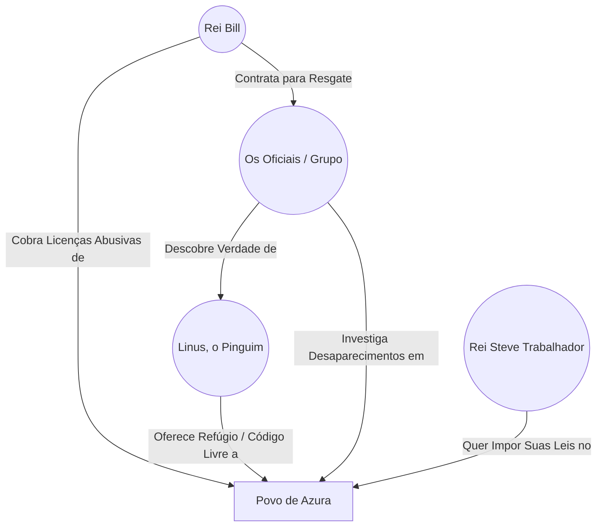
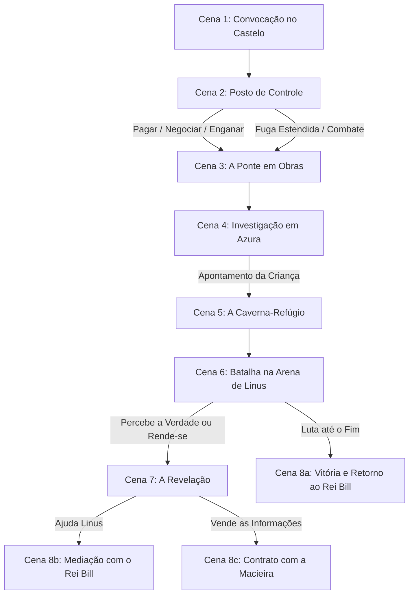

---
tags:
  - projeto/rpg
  - campanha/tormenta20
  - status/producao
  - tema/parodia-tecnologica
  - t20/reino-das-janelas
sistema: Tormenta20
tipo: One-Shot
nivel_recomendado: 4-5
relogio_fuga_posto: 0
relogio_ponte: 0
---

# 🪟 O Mistério do Reino das Janelas
> "Tome cuidado com suas palavras. Um Rei não é governado por ameaças, mas por sabedoria." — Rei Bill

![[windows_kingdom.png]]
![[underground_mana_cavern_map.png]]

---

## 📜 Backstory (História de Fundo)
O Reino das Janelas é governado pelo simpático (porém burocrático) Rei Bill. É uma terra próspera, mas atormentada por taxas abusivas, infraestrutura decadente e uma sensação constante de engessamento. Recentemente, dezenas de moradores da pacata vila de Azura desapareceram sem deixar vestígios de luta, itens roubados ou pegadas claras.

O que o Rei Bill acredita ser uma série de sequestros por forças rebeldes é, na verdade, um movimento voluntário de libertação. Guiados por **Linus**, um Pinguim Gigante Colossal e guardião do código livre, esses cidadãos fugiram para uma enorme caverna-refúgio nas montanhas para viverem em uma comunidade autônoma e sem impostos, longe das amarras do Reino das Janelas e do autoritarismo do Império da Macieira (governado pelo rígido Rei Steve Trabalhador).

---

## 📍 Como Chegar & Ponto de Partida
* O grupo de aventureiros (conhecidos como **Os Oficiais**) começa de frente ao portão principal do Castelo das Janelas.
* Eles foram convocados para uma audiência urgente nos jardins do fundo com o Rei Bill, local onde ele tem a vista de uma bela campina.

---

## 🎭 A Teia da Conspiração (Grafo de Relações)


---

## 🌩️ NPCs & Personagens Chave
* **Rei Bill:** Governa o Reino das Janelas. Fala de forma travada e reticente (como se estivesse processando e "carregando" as ideias). Valoriza a diplomacia, mas impõe licenças rígidas aos cidadãos.
* **Sargento Norton (Guarda do Portão):** Um dos servos do castelo, sempre vigilante quanto a pergaminhos e defesas do salão principal.
* **Alfred Cortana (Mordomo):** Conhece os segredos da biblioteca real e os registros históricos de impostos.
* **Linus (O Pinguim Colossal):** Chefe supremo da Caverna-Refúgio. Um Pinguim gigante de olhar austero que defende a liberdade irrestrita do seu povo contra a corrupção e a burocracia dos reinos.
* **Rei Steve Trabalhador:** Imperador do vizinho Império da Macieira. Oferece ordem e velocidade, mas exige controle absoluto de roupas, estilos de vida e conduta de seus cidadãos.

---

## ⚙️ Painel do Mestre (Meta Bind)

### ⏳ Relógios da Sessão

**Fuga / Burlar o Posto de Controle (Cena 2):** ( `VIEW[{relogio_fuga_posto}]` / 3 )
```meta-bind
INPUT[slider(minValue(0), maxValue(3)):relogio_fuga_posto]
```

**Travessia da Ponte em Colapso (Cena 3):** ( `VIEW[{relogio_ponte}]` / 5 )
```meta-bind
INPUT[slider(minValue(0), maxValue(5)):relogio_ponte]
```

---

## 🕐 Detalhamento dos Relógios & Regras Especiais

### 1. Fuga / Burlar o Posto de Controle (3 Segmentos por Personagem)
* **Objetivo:** Passar pelo posto sem pagar a licença abusiva de 1.000 Tibares por personagem.
* **Perícias Permitidas (CD 20):**
  * **Atletismo ou Acrobacia:** Para fugir correndo dos guardas.
  * **Furtividade:** Para se afastar e passar escondido.
  * **Sobrevivência:** Para desviar pela floresta densa ao redor.
  * *Qualquer outra perícia bem justificada (não pode repetir a mesma perícia no mesmo teste estendido).*
* **Custo & Penalidades:** Cada tentativa consome **2 PM** pelo desgaste físico.
* **Resolução (Sucesso):** 3 sucessos antes de 3 falhas permitem atravessar sem pagar.
* **Resolução (Falha):** Se acumular 3 falhas, o personagem é capturado, obrigado a pagar e o Rei Bill é notificado.

### 2. Colapso na Ponte em Obras (5 Segmentos)
* **Objetivo:** Atravessar a área de serviço instável sob o ataque do enxame antes que tudo desabe no rio.
* **Opções por Rodada:**
  * **Atletismo ou Acrobacia (CD 20):** Esquivar dos destroços e correr.
  * **Teste de Ataque (contra CA 18):** Acertar e matar um dos insetos gigantes.
* **Penalidade por Falha:** Cada falha individual causa **1d6 de dano**.
* **Queda:** Acumular 3 falhas faz o personagem cair no rio turbulento, sofrendo **1d12 de dano**.
* *Auxílio:* O primeiro personagem a atingir os sucessos necessários pode usar seus turnos subsequentes para dar +2 nos testes dos aliados.

---

## 🗺️ Fluxo de Cenas (Árvore da Aventura)


---

## 📄 Roteiro de Cenas

### Cena 1: Convocação para a Missão
* **Local:** Portões dos fundos do Castelo do Reino das Janelas.
* **Mecânica de Coleta de Informação:**
  * Teste de **Investigação (CD 10)** com os servos do castelo.
  * Se o grupo for **educado**, não precisa de teste para extrair informações dos servos.
  * Se for **rude**, exige teste de **Diplomacia** ou **Intimidação (CD 20)** para que o servo fale.
* **Servos & Dicas:**
  * *Sargento Norton (Guarda):* Menciona pergaminhos no pedestal do trono (Pergaminhos de Bola de Fogo x3).
  * *Chef Micro (Cozinheiro):* Menciona garrafas na despensa (Essência de Mana x7).
  * *William Dows (Camareiro):* Menciona caixa nos aposentos (Bálsamo Restaurador x7).
  * *Alfred Cortana (Mordomo):* Menciona itens na biblioteca (Poções de Curar Ferimentos x5).
  * *Miss Officia (Secretária Real):* Menciona papéis caídos no escritório.
  * *Sir Bingus (Diplomata):* Menciona baú reluzente no salão de guerra.
  * *Joe Clenny (Faxineiro):* Menciona baú poeirento no porão.
* **Proposta do Rei Bill:**
  * Recompensa de **2.000 Tibares por jogador** + **100 Tibares por desaparecido com vida** (50% adiantado).
  * *Negociação de Recompensa (Diplomacia):*
    * **CD 15:** 2.300 Tibares + 120 por vida.
    * **CD 25:** 3.000 Tibares + 150 por vida.
  * *Intimidação:* Não aumenta o valor. Dependendo da agressividade, o Rei reduz o pagamento ou cobra a própria vida dos Heróis como teste de honra.

---

### Cena 2: O Posto de Controle
* **Local:** Estrada de Azura (2 horas de viagem do castelo).
* **A Situação:** Cobrança de **1.000 Tibares por licença anual** de trânsito.
* **Opções do Grupo:**
  * **Pagar:** 1.000 Tibares por personagem.
  * **Negociar (Diplomacia):** CD 15 (700 T), CD 20 (500 T), CD 25 (250 T), CD 30 (Grátis).
  * **Enganação / Intimidação:** CD 25 / CD 30 permite passar. *(Nota: Dizer que o Rei autorizou não engana os guardas, pois a cobrança é uma Ordem Real).*
  * **Fuga:** Executar o Relógio de Fuga do Posto (**2 PM de custo por tentativa**).
  * **Combate:** Provocar combate aciona o alerta do castelo. Se um guarda escapar (Percepção CD 30 para notar), o Rei desconta **500 Tibares** da recompensa final (ou decreta prisão se houver mortes).

---

### Cena 3: A Ponte em Obras
* **Investigação da Travessia:** Teste de **Investigação (CD 20)** para achar o caminho seguro pelos andaimes da área de serviço.
  * *Falha:* O grupo escolhe o pior caminho e sofre **+1d6 de dano** no ataque a seguir.
* **Alerta Prévia:** Teste de **Intuição ou Percepção (CD 25)** percebe o perigo e concede **1 Sucesso Automático** no teste de Reflexos.
* **Ataque do Enxame:** Enxame de insetos gigantes ataca. **Teste de Reflexos (CD 25)** ou recebe **1d4 de dano** (+1d6 se falhou na Investigação).
* **Colapso da Ponte:** Executar o **Relógio de Travessia da Ponte** (5 sucessos antes de 3 falhas).
* **Tesouro do Povo:** Do outro lado, encontram um baú deixado pelos trabalhadores (Rolar na **Tabela de Recompensas de Tormenta20 - ND 4**).

---

### Cena 4: Investigação em Azura
* O grupo realiza testes em locais estratégicos para juntar o quebra-cabeça:
  * **Padaria (CD 15):** Escutam papos sobre uma família que fugiu para o Império da Macieira deixando uma maçã mordida na janela.
  * **Estábulo (CD 20):** Relato de passos desajeitados e revoada na noite do desaparecimento.
  * **Mercado (CD 20):** Bêbado diz ter visto um vulto alado enorme.
  * **Prefeitura (CD 30):** O prefeito revela que a insatisfação com as licenças e obras é generalizada.
  * **Biblioteca (CD 25):** Metade dos sumidos não tinha dinheiro para pagar a licença e perderia a cidadania.
  * **Casa do Desaparecido (CD 25):** Encontram uma carta denunciando as licenças abusivas e chamando para a "Verdadeira Liberdade".
    * *Armadilha:* O armário é um **Mímico**. Quem tentar abrir sem checar é abocanhado e fica inconsciente a menos que seja curado (Cura CD 15 ou magia).
* **O Ponto de Virada (A Criança):** Uma criança aborda o personagem mais gentil do grupo dizendo que um dragão tomou os seus tios e voou em direção às montanhas.
* *Aviso de Tempo:* Se realizarem **mais de 7 testes** na vila (30 min por teste), o grupo chegará à montanha durante a noite (penumbra/escuridão).

---

### Cena 5: A Caverna-Refúgio
* **Entrada:** Teste de **Sobrevivência ou Investigação (CD 15)** encontra a entrada disfarçada ao pé da montanha.
* **O Ambientes:** A caverna é imensa (maior que o Castelo das Janelas), abrigando um rio e um acampamento organizado.
  * *De Dia:* Pessoas trabalhando alegremente, fazendo cestos, lavando roupas e cozinhando.
  * *De Noite:* Tochas apagadas, todos dormindo.
* **Acolhida:** Ao se aproximarem, uma explosão de chamas atinge o chão ao lado com o urro: *"NÃO SE APROXIMEM!"*

---

### Cena 6: Batalha contra Linus (O Pinguim Gigante)
* **Chefe:** Linus, o Pinguim Gigante Colossal (Rei da Arena - ND 5/6).
* **Efeitos de Arena (Vórtice Místico):**
  * **Lacaios (Distros):** Invocados por Linus (Ubuntu, Mint, Fedora, Debian).
  * **Armadilha Oculta:** Pisou, sofre **2d6 de dano** e fica Imóvel por 1 rodada (Reflexos evita).
  * **Linhas de Mana:** Linus ganha +2 na CD de magias e +2 PM por turno. Um herói pode gastar 1 Ação de Movimento e passar em **Misticismo (CD 20)** para roubar esse bônus por 1 rodada (1x por cena/personagem).
  * **Orbe Elemental:** Linus ignora 50% de dano de fogo. O Orbe é Imune a Fogo e Vulnerável a Água (vida de Lacaio ND 4).
* *Gatilho de Diálogo:* Se algum jogador verbalizar no combate que entendeu que o povo está ali por livre vontade, interrompa a luta e vá para a **Cena 7**.

---

### Cena 7: A Revelação
* Ativada ao atingir **40% dos PVs de Linus** ou por interação social no combate.
* Linus questiona os interesses do Rei Bill e revela que **ninguém foi sequestrado**.
* Ele explica o conceito da "Comunidade do Código Livre": vida sem amarras, sem impostos abusivos, e de cooperação mútua contra os abusos do Reino das Janelas e do Império da Macieira.
* Linus afirma ter enviado uma carta formal ao Rei Bill avisando da segurança de todos, mas a resposta de Bill foi enviar mercenários.

---

### Cena 8: Desfecho & Conclusão
* **8a. Lealdade ao Rei Bill:** Derrotam Linus, forçam o povo a voltar, recebem a recompensa e títulos de Heróis de Estado.
* **8b. Mediação de Paz:** Convencem Bill a negociar um tratado de paz com a comunidade de Linus. Bill aceita a conversa a contragosto.
* **8c. Aliança com a Macieira:** Levam as informações ao Rei Steve Trabalhador no Império da Macieira. Ele paga a recompensa, mas exige que o grupo e os refugiados sigam todas as suas regras rígidas e uniformes.

---

## 🧌 Adversários & Banco de Dados (Dataview)

```dataview
TABLE nivel, fraqueza, hp_max
FROM #inimigo AND #t20/reino-das-janelas
SORT nivel DESC
```

* **Linus, o Pinguim Gigante** (Monstro / Chefe Colossal)
* **Distros: Capangas de Linus** (Humanoide / Capanga ND 1/2)
* **Enxame de Insetos da Ponte** (Animal / Bando ND 3)
* **Mímico da Casa** (Monstruosidade / ND 3)
* **Guardas do Posto de Controle** (Humanoide / Capanga ND 1)