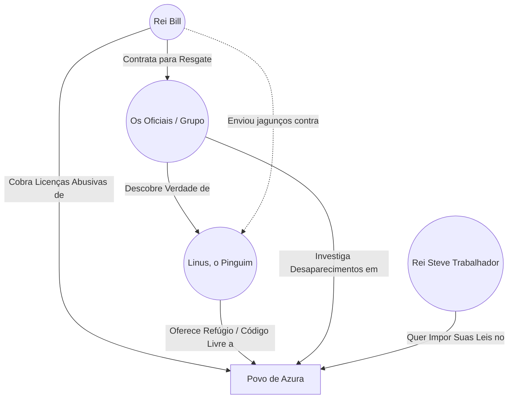
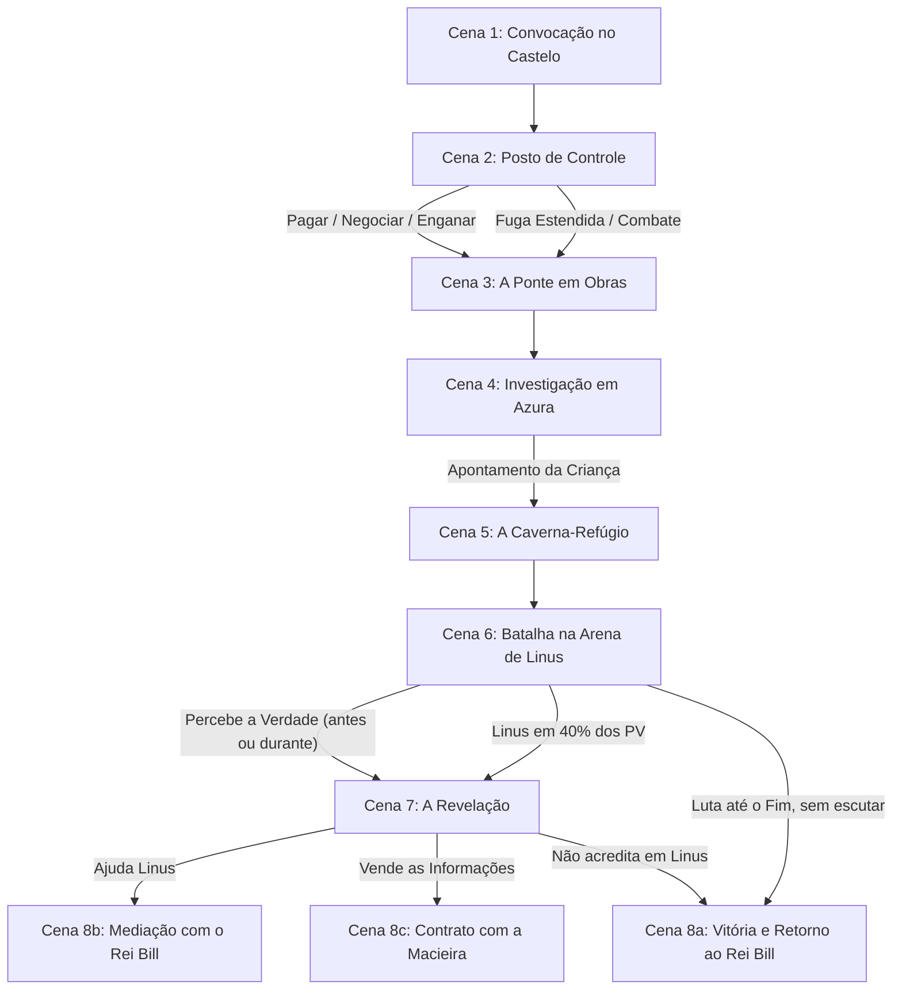

---
tags:
- projeto/rpg
- campanha/tormenta20
- status/producao
- tema/parodia-tecnologica
- t20/reino-das-janelas
sistema: Tormenta20
tipo: One-Shot
nivel_recomendado: 4-5
duracao_estimada: 3-4h
jogadores_ideal: 4
relogio_fuga_posto: 0
relogio_ponte: 0
testes_azura: 0
---
 
# 🪟 O Mistério do Reino das Janelas

> "Tome cuidado com suas palavras. Um Rei não é governado por ameaças, mas por sabedoria." — Rei Bill

![[windows_kingdom.png]] ![[underground_mana_cavern_map.png]]

---

## 🧭 Visão Geral (leia primeiro)

**Em uma frase:** os heróis são contratados para resgatar "sequestrados" que, na verdade, fugiram por vontade própria para a comunidade livre de um pinguim colossal. O vilão pode ser o contratante.

**Dilema central:** liberdade sem amarras _versus_ ordem com preço. Nenhum dos três reinos é inocente:

|Poder|Promete|Cobra|
|---|---|---|
|**Reino das Janelas** (Rei Bill)|Estabilidade e tradição|Licenças abusivas, obras eternas, burocracia, insegurança|
|**Comunidade do Código Livre** (Linus)|Liberdade total, sem impostos|Cada um por si e todos por todos. Ninguém garante segurança além do próprio grupo, e ele atacou quem se aproximou|
|**Império da Macieira** (Rei Steve Trabalhador)|Beleza, rapidez, segurança|Controle absoluto de roupas, armas e estilo de vida|

**Ritmo sugerido (3–4h):**

|Cena|Tempo|Tipo|
|---|---|---|
|1. Convocação|20 min|Roleplay + exploração|
|2. Posto de Controle|20 min|Social ou desafio de fuga|
|3. Ponte em Obras|30 min|Desafio estendido|
|4. Azura|40 min|Investigação|
|5. Caverna|10 min|Atmosfera|
|6. Linus|50 min|Combate|
|7–8. Revelação e Desfecho|20–30 min|Roleplay|

> [!warning] Ajustes de regra e furos do rascunho original Marquei aqui as decisões que tomei. Confirme se concorda.
> 
> 1. **Falhas no posto de controle:** o rascunho diz "3 sucessos antes de 3 falhas" e depois "se falhar duas vezes". Padronizei em **3 sucessos antes de 3 falhas**.
> 2. **"CA 18":** Tormenta20 usa **Defesa**, não CA. Troquei por Defesa.
> 3. **Orbe Elemental:** o rascunho diz que ele tem "a vida de um lacaio com ND igual ao do chefe". Interpretei como PV de um capanga de ND 5 (valores na ficha).
> 4. **Caminhada até a caverna:** o original tem "duas três horas". Fixei em **3 horas**.
> 5. **Relógios individuais:** posto e ponte são testes estendidos **por personagem**. Os sliders do Painel servem para o personagem da vez. Com 4+ jogadores, duplique-os (`relogio_fuga_p1`, `p2`...).
> 6. **Dataview:** mantive a consulta original. Ela só retorna dados quando cada adversário tiver sua própria página com as tags `inimigo` e `t20/reino-das-janelas` e os campos `nivel`, `fraqueza` e `hp_max` no frontmatter. Enquanto isso, as fichas de referência continuam escritas na própria nota.
> 7. **Valores de combate** (Defesa, PV, dano, CDs das fichas) são sugestões **de referência**. Calibre com a tabela de criação de ameaças do livro antes de jogar.

---

## 📖 Introdução (leia em voz alta)

> [!quote] Abertura Vocês são os **Defensores**: aventureiros experientes, conhecidos em todo o **Reino das Janelas**. O reino é próspero e feliz, governado pelo simpático Rei Bill. Mas, como todo reino que vive há tempo demais com o mesmo sistema, ele tem uma série de problemas esperando para serem resolvidos. Esta manhã, um mensageiro bateu à porta de cada um de vocês: o Rei requisita sua presença. Agora vocês estão diante dos imponentes portões do castelo.

---

## 📜 Backstory (para o Mestre)

O Reino das Janelas é governado pelo simpático (porém burocrático) Rei Bill. É uma terra próspera, mas atormentada por taxas abusivas, infraestrutura decadente e uma sensação constante de engessamento. Há cerca de uma semana, dezenas de moradores da vila de **Azura** desapareceram sem sinais de luta, itens roubados ou pegadas claras.

O que o Rei acredita serem sequestros é, na verdade, um **êxodo voluntário**. Guiados por **Linus**, um Pinguim Colossal e guardião do código livre, os cidadãos fugiram para uma enorme caverna-refúgio nas montanhas, onde vivem em comunidade autônoma e sem impostos, longe das amarras do Reino das Janelas e do autoritarismo do Império da Macieira.

**Detalhe importante:** Linus enviou uma carta ao Rei Bill avisando que todos estavam bem. A resposta de Bill foi enviar jagunços para matá-lo. Bill ou nunca leu a carta ou ignorou. Decida qual versão usar de acordo com o final que a mesa tomar (veja Cena 8b).

**O que os cidadãos queriam (use nos testemunhos):**

- Perderiam a cidadania por não conseguir pagar a licença anual.
- Burocracia, corrupção, bandidos "pra todo lado".
- Insetos gigantes cada vez mais frequentes; não querem criar os filhos ali.

---

## 🎭 A Teia da Conspiração



---

## 🌩️ NPCs & Personagens-Chave

### Rei Bill

- **Papel:** governa o Reino das Janelas. Simpático, diplomata e burocrático.
- **Voz:** fala de forma **travada e reticente**, como se estivesse "carregando" as ideias. Pausas, "hmm...", "só um momento...".
- **Motivação:** manter a ordem e a arrecadação. Genuinamente preocupado com o povo, mas não percebe que é parte do problema.
- **Reação moderada à pressão:** _"Tome cuidado com suas palavras. Um Rei não é governado por ameaças, mas por sabedoria."_
- **Reação agressiva:** _"Retiro minha oferta. Agora, considerem isso um teste de sua honra, pois o Reino das Janelas não pagará mercenários sem respeito."_ O personagem agressor perde a recompensa, e sua vida passa a ser a recompensa.
- **Exemplo de fala:** _"Hmm... na última semana... houve um desaparecimento... repentino... de muitas pessoas... carregando... em Azura."_

### Linus (o Pinguim Colossal)

- **Papel:** chefe supremo da Caverna-Refúgio e guardião do código livre. Olhar austero.
- **Motivação:** defender a liberdade irrestrita do seu povo.
- **Voz:** grave, direta, sem rodeios. Pessoa que odeia propriedade fechada e imposição.
- **Defeito:** desconfiado a ponto de atacar primeiro. O povo gosta dele, mas a "liberdade" tem custo: quem cuida da segurança agora é só ele.

### Rei Steve Trabalhador

- **Papel:** imperador do Império da Macieira. Oferece ordem, beleza e velocidade.
- **Exige:** controle absoluto de roupas, armas, penteados, casas e estilo de vida.
- **Voz:** carismático, minimalista, adora anúncios dramáticos. Frase-assinatura: _"Ah, e só mais uma coisa..."_ antes de cada exigência nova.

### Servos do Castelo (veja a Cena 1)

Sargento Norton, Chef Micro, William Dows, Alfred Cortana, Miss Officia, Sir Bingus, Joe Clenny.

> [!tip] Easter eggs para jogadores que pegam a referência Norton (antivírus), Micro (Microsoft), William Dows (Windows), Cortana (assistente), Miss Officia (Office), Sir Bingus (Bing), Joe Clenny (limpeza de sistema), Distros (Ubuntu, Mint, Fedora, Debian), Rei Steve Trabalhador, Macieira e maçã mordida. Não explique. Deixe quem entende rir sozinho.

---

## ⚙️ Painel do Mestre (Meta Bind)

### ⏳ Relógios da Sessão

**Fuga / Burlar o Posto de Controle (Cena 2):** ( `VIEW[{relogio_fuga_posto}]` / 3 )

```meta-bind
INPUT[slider(minValue(0), maxValue(3)):relogio_fuga_posto]
```

**Travessia da Ponte em Colapso (Cena 3):** ( `VIEW[{relogio_ponte}]` / 5 )

```meta-bind
INPUT[slider(minValue(0), maxValue(5)):relogio_ponte]
```

**Testes feitos em Azura (Cena 4, cada um custa 30 min):** ( `VIEW[{testes_azura}]` / 8 )

```meta-bind
INPUT[slider(minValue(0), maxValue(8)):testes_azura]
```

> Mais de **7 testes** e o grupo chega à caverna à noite.

---

## 🕐 Detalhamento dos Relógios & Regras Especiais

### 1. Fuga / Burlar o Posto de Controle

- **Quem:** cada jogador que escolher fugir faz o seu próprio teste estendido.
- **Objetivo:** passar sem pagar a licença de 1.000 Tibares.
- **Regra:** **3 sucessos antes de 3 falhas** (CD 20).
- **Perícias permitidas:**
    - **Atletismo ou Acrobacia:** fugir correndo dos guardas.
    - **Furtividade:** afastar-se e passar escondido.
    - **Sobrevivência:** desviar pela floresta densa ao redor.
    - **Qualquer outra perícia bem justificada.** Não pode repetir a mesma perícia no mesmo teste estendido.
- **Custo:** cada jogador que tentar gasta **2 PM**, representando tempo perdido e cansaço.
- **Falha total:** é pego, precisa pagar a licença e o Rei Bill é avisado da tentativa de fuga.

### 2. Colapso na Ponte em Obras

- **Quem:** cada personagem faz seu próprio teste estendido, **5 sucessos antes de 3 falhas**.
- **Opções a cada rodada:**
    - **Atletismo ou Acrobacia (CD 20):** correr e esquivar dos destroços.
    - **Ataque contra Defesa 18:** acertar e matar um dos insetos gigantes. Conta como sucesso apenas se o inseto morrer. Insetos soltos morrem com qualquer acerto.
- **Falha:** cada falha causa **1d6 de dano**.
- **Queda:** 3 falhas fazem o personagem cair no rio, sofrendo **1d12 de dano**. (Fica fora da travessia e precisa nadar de volta. Se quiser misericórdia, ele chega ao outro lado molhado, mas vivo.)
- **Auxílio:** o primeiro a completar pode gastar seus turnos para dar **+2** nos testes dos aliados.

---

## 🗺️ Fluxo de Cenas



---

## 📄 Roteiro de Cenas

### Cena 1: Convocação para a Missão

> [!quote] Leia em voz alta Os portões do Castelo das Janelas se erguem diante de vocês, cheios de janelinhas de todos os tamanhos. Alguns servos circulam pelo pátio. Um mensageiro avisa que o Rei os espera nos jardins dos fundos, onde tem a vista de uma bela campina.

**Objetivo:** dar o gancho, entregar a recompensa e permitir que os jogadores se abasteçam.

**Conseguindo informação dos servos:**

- Teste de **Investigação (CD 10)** ou **conversar** com um servo.
- Se o grupo for **educado**, **nenhum teste é necessário**.
- Se for **rude**, o personagem que cometeu a grosseria precisa de **Diplomacia ou Intimidação (CD 20)** para arrancar a informação daquele servo.

**Servos e dicas (falas originais):**

|Servo|Fala|Onde está o item|Sugestão de loot|
|---|---|---|---|
|**Sargento Norton** (guarda do portão)|_"Ah, aventureiros, se estiverem procurando algo útil, ouvi dizer que os arcanistas às vezes deixam pergaminhos poderosos no salão principal. Talvez estejam no pedestal ao lado do trono."_|Pedestal do trono|2 Pergaminhos de Bola de Fogo|
|**Chef Micro** (cozinheiro)|_"Se eu fosse vocês, daria uma olhada na despensa. Pode parecer só comida, mas tenho certeza de que há algumas garrafas diferentes por lá."_|Despensa|4 Essências de Mana|
|**William Dows** (camareiro)|_"Enquanto limpava os aposentos reais, notei uma pequena caixa lacrada no armário. Talvez tenha algo valioso, se souberem como abri-la."_|Caixa lacrada (Ladinagem CD 15 ou força bruta)|7 Bálsamos Restauradores|
|**Alfred Cortana** (mordomo)|_"Na biblioteca do castelo, há sempre algo interessante deixado para trás por estudiosos. Olhem entre os livros, talvez encontrem algo que possa ajudar."_|Biblioteca|3 Poções de Curar Ferimentos|
|**Miss Officia** (secretária real)|_"Ah, os pergaminhos? Bem, sei que o Rei pediu para guardar alguns em seu escritório, mas eles podem ter caído na confusão recente."_|Escritório (papéis caídos)|1 Pergaminho de Bola de Fogo|
|**Sir Bingus** (diplomata)|_"Na última vez que passei pelo salão de guerra, vi um brilho estranho vindo de um baú pequeno perto do mapa estratégico. Pode valer a pena dar uma olhada."_|Baú reluzente no salão de guerra|2 Poções de Curar Ferimentos|
|**Joe Clenny** (faxineiro)|_"Enquanto limpava o porão, encontrei um baú velho coberto de poeira. Não sei o que tem dentro, mas parecia importante."_|Baú poeirento no porão|3 Essências de Mana|

> [!info] Distribuição do loot O rascunho original lista os itens totais mas não diz onde cada um está. A divisão acima respeita os totais: **5 Poções de Curar Ferimentos, 7 Bálsamos Restauradores, 7 Essências de Mana, 3 Pergaminhos de Bola de Fogo**.

**Busca livre no castelo:** teste de **Investigação** ao explorar por conta própria. **CD 15** encontra 1 item. **CD 30** encontra todos.

**A audiência com o Rei Bill (jardins dos fundos):**

> [!quote] Leia em voz alta O Rei Bill os recebe com um sorriso largo. Ele hesita antes de cada frase, como se procurasse as palavras. "Aventureiros... obrigado por virem. Estou... preocupado."

- Na última semana, **muitas pessoas desapareceram** da vila de Azura.
- Tudo aconteceu em condições misteriosas, **sem sinais de luta** e **sem objetos de valor levados**.
- Algumas pessoas dizem ter ouvido **sons à noite**, mas **nenhum rastro** foi encontrado.

**Proposta:**

- **2.000 Tibares por jogador** se encontrarem os desaparecidos, **mais 100 Tibares por desaparecido devolvido com vida**.
- **Metade da recompensa fixa é paga adiantado** (1.000 por jogador).

> [!tip] Presente para o Mestre A licença do posto custa **1.000 Tibares por personagem**: exatamente o adiantamento. Quem pagar sem pensar, volta ao ponto zero. Isso serve de piada e de pressão para tentar outras alternativas.

**Negociação (Diplomacia):**

|Resultado|Recompensa|
|---|---|
|CD 15|**2.300** Tibares + **120** por vida|
|CD 25|**3.000** Tibares + **150** por vida|

**Intimidação não aumenta a recompensa.** Dependendo da agressividade, o Rei reage em dois níveis (falas na seção de NPCs): moderada (aviso) e agressiva (retira a oferta ao personagem e declara que a vida dele é a recompensa; leve isso como pressão dramática, não como fim de jogo).

Com a missão aceita, o grupo deve **pegar a estrada em direção a Azura**.

---

### Cena 2: O Posto de Controle

> [!quote] Leia em voz alta Depois de duas horas de estrada, vocês chegam a um posto de controle. Uma cancela, uma guarita e uma fila de viajantes que parece não andar. Um guarda de expressão entediada ergue a mão: "Licença de trânsito. Mil Tibares por cabeça."

**Situação:** cobrança de **1.000 Tibares por licença anual de trânsito**, ordem Real.

- Quem disser que **já tem licença**: o guarda pede para ver, olha, e diz que **expirou, já passou um ano**.
- Dizer que **o Rei autorizou** **não engana** os guardas, pois a licença é ordem Real.

**Opções do grupo:**

|Opção|Resultado|
|---|---|
|**Pagar**|1.000 Tibares por personagem|
|**Negociar (Diplomacia)**|CD 15 → 700 T · CD 20 → 500 T · CD 25 → 250 T · CD 30 → grátis|
|**Intimidação**|CD 30 permite passar|
|**Enganação**|CD 25 (depende da mentira) permite passar|
|**Fuga**|Teste estendido (ver Relógio 1), **2 PM** por tentativa|
|**Combate**|Veja abaixo|

**Combate no posto:**

- Qualquer um que tentar entrar no posto provoca um combate com os guardas.
- **Não há espólios**: eles só possuem suas armas.
- **Independentemente do resultado**, um guarda foge discretamente para avisar o Rei. Um teste de **Percepção (CD 30)** ao final da batalha percebe o guarda correndo ao longe na direção do Castelo.
- Se o guarda escapar, o Rei **desconta 500 Tibares** da recompensa final.
- Se **algum guarda morrer**, o Rei manda os heróis para a **masmorra** (cena extra, ou bônus no desfecho 8a).

**Guardas do Posto** (Humanoide / Capanga ND 1): ver ficha em Adversários.

---

### Cena 3: A Ponte em Obras

> [!quote] Leia em voz alta A estrada termina em uma ponte coberta de andaimes, tapumes, carrinhos de mão e um engarrafamento monstruoso. É impossível passar direto. Pelo tom das buzinas, essa obra já devia ter terminado há muito tempo.

**Passo 1: Investigar a travessia.**

- **Investigação (CD 20)**: revela que é preciso passar pelos **andaimes** e entrar na **área de serviço**.
- **Nenhum sucesso:** o grupo escolhe mal os andaimes, e o dano do enxame aumenta em **+1d6** no teste de Reflexos. _(Narre como uma escolha, não como azar: "vocês entram pelo andaime mais bonito, o mais mal parafusado".)_

**Passo 2: Sentir o perigo.**

- **Intuição ou Percepção (CD 25):** percebe que o local não é seguro e dá **1 sucesso automático** no teste de Reflexos que vem a seguir.

**Passo 3: O enxame.**

> [!quote] Leia em voz alta Um zumbido sobe da área de serviço. Vocês olham... e é tarde demais: um **enxame de insetos gigantes** vem na direção de vocês.

- **Reflexos (CD 25)**; quem falha recebe **1d4 de dano** (+1d6 se falhou na Investigação).

**Passo 4: O colapso.**

> [!quote] Leia em voz alta Na confusão, a área de serviço estremece. Os andaimes rangem. Tudo começa a ruir em direção ao rio.

- Execute o **Relógio de Travessia** (5 sucessos antes de 3 falhas, por personagem). Detalhes na seção de Relógios.

**Tesouro do Povo:** do outro lado, vocês encontram um baú deixado pelos trabalhadores. Role na **Tabela de Recompensas de Tormenta20, ND 4**.

---

### Cena 4: Investigação em Azura

> [!quote] Leia em voz alta Azura é uma vila pequena, com cara de quem vive mais do que ganha. Há janelas quebradas, calçadas remendadas e olhares desconfiados. Todos parecem ter alguma queixa e nenhum sabe de nada.

**Regra:** o grupo faz testes de investigação em locais diferentes. **Cada teste leva 30 minutos** (marque no slider `testes_azura`). **As informações servem apenas para montar o quebra-cabeça. Não encontrar nada não gera penalidade.**

|Local|CD|O que descobrem|
|---|---|---|
|**Padaria**|15|Conversa de três moradores (veja abaixo)|
|**Estábulo**|20|Alguém ouviu **passos desajeitados** e **uma grande revoada** na noite em que um vizinho desapareceu|
|**Mercado**|20|Um **bêbado** viu um **grande vulto** nas ruas algumas semanas atrás|
|**Prefeitura**|30|O prefeito revela que os últimos desaparecidos estavam **muito insatisfeitos** (obras, licenças) e sumiram dias depois. A insatisfação é **generalizada**|
|**Biblioteca**|25|**Pelo menos metade** dos desaparecidos **não tinha dinheiro** para a licença e perderia a cidadania|
|**Casa do desaparecido mais recente**|25|Uma **carta** (veja abaixo) e um **mímico**|

**Padaria: o debate dos três moradores**

> [!quote] Leia em voz alta Três moradores conversam em uma mesa nos fundos. Um deles diz, baixinho: "Uma família foi embora do Reino das Janelas e se mudou para o Império da Macieira. Quebraram a janela da casa e deixaram uma maçã mordida lá, que é o símbolo de quem se muda para lá."

- Um pergunta aos outros dois: _"Vocês fariam o mesmo?"_
- **Primeiro morador:** _sim._ Lá tudo funciona melhor, é mais rápido, bonito, arrumado, seguro.
- **Segundo morador:** _jamais._ Lá não existe liberdade. Roupas, cabelo, casas, tudo é do jeito que o Rei Steve Trabalhador manda, "ou você pode ser banido ou coisa pior".

_(Isso planta a Macieira como destino possível e prepara a Cena 8c.)_

**A carta na casa do desaparecido:**

> A carta denuncia que as **licenças são abusivas**, que o Rei **não permitia que morassem onde quisessem**, nem que recebessem **parentes distantes** de outros lugares do Reino ou de outros Reinos. Chama o leitor para **"a verdadeira Liberdade"**.

**Armadilha: o Mímico.**

- A casa tem um **armário** que é um **Mímico**.
- Quem tentar abri-lo sem verificar é **abocanhado** e **fica inconsciente**.
- Se ninguém ajudar, o mímico **desiste** do personagem. Para despertá-lo é necessário **Cura (CD 15)** ou qualquer magia de cura.
- **O Mímico não engaja em combate.** Ele só morde quem se aproxima do baú.

**O Ponto de Virada: a Criança.**

> [!quote] Leia em voz alta Uma criança se aproxima do personagem mais gentil do grupo e puxa a barra de sua roupa. Fala baixinho: "Eu acho que um **dragão** dominou a mente dos meus tios. Eu vi eles saírem de casa de noite, **só com as roupas do corpo**, sem levar nada. Aí uma coisa **muito grande** veio voando e **apagou as pegadas**." Ela aponta na direção das montanhas.

**Isso acontece independentemente dos testes.**

> [!warning] Relógio da noite Se o grupo fizer **mais de 7 testes** (independentemente do sucesso), eles chegarão à montanha **à noite**, com **visibilidade limitada** (veja Cena 5).

**Sugestão de cronometragem:** partida do castelo às 8h, posto às 10h, ponte por volta das 10h45 e Azura por volta das 11h. Com 7 testes, o grupo sai às 14h30, caminha 3 horas e chega por volta das 17h30 (entardecer). Com 8 ou mais, é noite.

---

### Cena 5: A Caverna-Refúgio

> [!quote] Leia em voz alta Depois de cerca de **três horas** caminhando na direção que a criança apontou, vocês chegam ao pé de uma montanha enorme. Nada parece fora do comum... a não ser a ausência total de pegadas.

**Entrada:** teste de **Sobrevivência ou Investigação (CD 15)** revela a entrada disfarçada. À noite, a visibilidade é limitada (penalidade de camuflagem ou necessidade de luz).

**O interior:** a caverna é **muito maior que o castelo do Rei Bill**. Há um **rio subterrâneo** e um **acampamento com várias barracas**.

- **De dia:** a caverna está bem iluminada. Pessoas trabalham alegremente fazendo cestos, lavando roupa, cozinhando.
- **De noite:** tochas apagadas, todos dormindo, silêncio total.

> [!quote] Acolhida Quando o grupo tenta se aproximar, um rugido corta o ar: **"NÃO SE APROXIMEM!"** Uma **explosão de chamas** atinge o chão bem ao lado de vocês.

**Dica de mestre:** deixe os jogadores olharem em volta por alguns segundos antes da explosão. Quem tiver **Intuição ou Percepção (CD 20)** nota que as pessoas **não estão amarradas**, **não parecem assustadas** e **não estão sob controle mental**. (Isso é uma pista que ajuda na Cena 6.)

---

### Cena 6: Batalha contra Linus (O Pinguim Colossal)

**Chefe:** Linus, o Pinguim Gigante Colossal. **Chefe final do tipo Rei da Arena**, ND 5 a 6 (ND 5 para 4 jogadores, ND 6 para 5 ou mais).

**Arena: Vórtice Místico (efeitos de arena):**

|Efeito|Regra|
|---|---|
|**Lacaios (Distros)**|Linus invoca Ubuntu, Mint, Fedora e Debian|
|**Armadilha Oculta**|Quem pisa sofre **2d6 de dano** e fica **Imóvel** por 1 rodada (**Reflexos CD 20** evita). Notar a armadilha: Percepção CD 25|
|**Linhas de Mana**|Linus ganha **+2 na CD** das magias e **+2 PM** no início do turno. Um herói pode gastar uma **ação de movimento** e passar em **Misticismo (CD 20)** para **roubar esse efeito por uma rodada** (1 vez por cena por personagem)|
|**Orbe Elemental**|Linus **ignora 50% do dano de fogo** enquanto o Orbe existir. O Orbe é **imune a fogo** e **vulnerável a água**|

> [!tip] Orbe como puzzle Dê pistas visuais: o Orbe gira acima do rio subterrâneo e emite chamas. Jogadores que pensarem "fogo contra pinguim... água contra o orbe" devem ser recompensados.

**Gatilho de diálogo:** se algum jogador **verbalizar que entendeu que o povo está ali por livre vontade** (e falar isso para Linus), **interrompa a luta** e vá para a **Cena 7**, **antes** da batalha acabar.

**Pistas durante o combate (para ajudar jogadores presos no "modo luta"):**

- Linus grita acusações: _"Foi o Bill que mandou vocês? Mais jagunços?"_
- Os aldeões **não fogem**: eles se reúnem ao fundo e **torcem por Linus**.
- Linus **evita** acertar os aldeões e **ataca só quem avança**.

**Estratégia dos Distros (lacaios):**

- **Ubuntu** protege Linus.
- **Mint** cura aliados.
- **Fedora** lança magias à distância.
- **Debian** segura a linha de frente, quase indestrutível.

**Fim da Fase 1:** quando Linus chegar a **40% dos PV**, ele para e pergunta o que o Rei Bill quer ali. Vá para a **Cena 7**.

---

### Cena 7: A Revelação

> [!quote] Linus (voz grave, ofegante) "Esperem... o que o **Rei Bill** quer de nós? Vocês vieram nos **resgatar**? Ninguém aqui foi sequestrado. **Todos estão aqui porque querem.**"

**O que Linus explica:**

1. As pessoas o procuraram porque queriam **uma vida livre**, longe das amarras do **Reino das Janelas** e do **Império da Macieira**.
2. No Reino das Janelas elas **não se sentem seguras**: muita **burocracia**, **corrupção**, **bandidos pra todo lado** e **insetos gigantes cada vez mais frequentes**. **Não querem criar os filhos ali.**
3. Ele promete **uma vida mais livre e sem amarras**: cada um faz a própria casa, tem o próprio negócio, **não paga impostos pra ninguém**, e **todos juntos cuidam da infraestrutura e da segurança** do local.
4. Ele **enviou uma carta ao Rei Bill** dizendo onde as pessoas estavam e que **estavam bem**. Tudo o que Bill fez foi **enviar jagunços para matá-lo**.

**Testemunhos de aldeões (para dar rosto à comunidade):**

- **O tio da criança de Azura** vem à frente e diz que está bem. Pede ao grupo que avise ao sobrinho que "tá tudo certo, e que o dragão é um pinguim". _(Fecha o arco da Criança.)_
- **O autor da carta** (o desaparecido mais recente) confirma que escreveu aquilo e que ninguém o obrigou.
- Uma aldeã conta que a família dela **não tinha dinheiro para a licença** e perderia a casa.

> [!warning] A verdade tem lados Linus **é sincero**, mas também **atacou primeiro** e **assustou pessoas**. Se o grupo perguntar sobre isso, ele reconhece: _"Aprendi a atirar primeiro depois que os jagunços chegaram."_ A comunidade tem problemas reais (sem governo, tudo depende da boa vontade de todos). Evite fazer de Linus um santo.

**Decisão:** o grupo escolhe o que fazer. Siga para a Cena 8.

---

### Cena 8: Desfecho & Conclusão

**8a. Lealdade ao Rei Bill (o grupo não acredita em Linus)**

- Derrotam Linus e **levam todos de volta**.
- Recebem a **recompensa adequada** do Rei Bill e as **honrarias de Heróis de Estado**.
- _Gancho:_ os aldeões voltam para casa e para as mesmas licenças que os fizeram fugir. A criança de Azura vê os tios voltarem calados.

**8b. Mediação de Paz (o grupo ajuda Linus)**

- Linus pede que o grupo vá até Bill e **interceda pela comunidade livre**, dizendo que todos estão **bem e em paz**.
- O Rei Bill, **a contragosto**, diz que **vai chamar Linus para conversar** e tentar uma solução pacífica.
- _Gancho:_ a conversa acontece, mas o tratado ainda precisa ser negociado. Linus aceita se o Rei prometer **não mandar mais jagunços**.

**8c. Aliança com a Macieira (o grupo vende as informações)**

- Levam tudo ao **Rei Steve Trabalhador**.
- Ele **paga a recompensa prometida por Bill**, mas exige que o grupo (e quem quiser trabalhar lá) **siga todas as leis**, inclusive **roupas e armas escolhidas pelo Rei**.
- _Fala sugerida:_ _"Ah, e só mais uma coisa... vocês vão precisar trocar de roupa."_

> [!quote] Encerramento De qualquer forma, **o que vem depois vai ficar para a imaginação de cada jogador.**

**Pagamento (resumo):**

- **Base:** 2.000 Tibares por jogador (ou 2.300 / 3.000 se negociaram), mais por desaparecido com vida (100 / 120 / 150).
- **Descontos possíveis:** -500 se um guarda escapou no posto; recompensa perdida para o personagem que desrespeitou o Rei.
- **Adiantamento:** 50% da parte fixa já foi pago na Cena 1.

---

## 🧌 Adversários & Banco de Dados (Dataview)

```dataview
TABLE nivel, fraqueza, hp_max
FROM #inimigo AND #t20/reino-das-janelas
SORT nivel DESC
```

- [[Linus, o Pinguim Gigante]] (Monstro / Chefe Colossal)
- [[Distros - Capangas de Linus]] (Humanoide / Capanga ND 1/2)
- [[Enxame de Insetos da Ponte]] (Animal / Bando ND 3)
- [[Mímico da Casa]] (Monstruosidade / ND 3)
- [[Guardas do Posto de Controle]] (Humanoide / Capanga ND 1)
- [[Orbe Elemental]] (Constructo / Capanga)

> [!tip] Frontmatter de cada página de adversário
> 
> ```yaml
> tags:
>   - inimigo
>   - t20/reino-das-janelas
> nivel: 6
> fraqueza: Água (Orbe)
> hp_max: 220
> ```
> 
> Ajuste `nivel`, `fraqueza` e `hp_max` em cada página. Os nomes dos links acima devem bater com os títulos das suas páginas.

---

## 📋 Fichas de Referência (inline)

> [!warning] Valores de referência Os números abaixo são **sugestões** para um grupo de 4 jogadores de nível 4–5. Calibre com a tabela de criação de ameaças de Tormenta20. Quando suas páginas individuais estiverem prontas, pode apagar esta seção.

### Guarda do Posto de Controle

**Humanoide / Capanga ND 1**

- **Defesa** 18 · **PV** 28 · **Fort** +6, **Ref** +4, **Von** +2 · **Percepção** +6
- **Deslocamento** 9m
- **Ataque:** lança de pedágio +8 (1d8+4)
- **Tática:** tentam algemar em vez de matar. Um deles foge para avisar o Rei.

### Enxame de Insetos Gigantes (Ponte)

**Animal / Bando ND 3**

- **Defesa** 18 (para acertar um inseto individual) · **PV** 5 por inseto (morre a qualquer acerto)
- **Ameaça:** o enxame é tratado como **efeito de cena** (Reflexos CD 25, 1d4 de dano). Se a mesa quiser combate, use 4 insetos por jogador, cada um com mordida +10 (1d6+2).

### Mímico da Casa

**Monstruosidade ND 3**

- **Defesa** 20 · **PV** 55
- **Mordida Engolidora:** quem tentar abrir o armário sem verificar fica **inconsciente** (Fortitude CD 20 evita). Despertar com **Cura (CD 15)** ou magia de cura.
- **Comportamento:** **não engaja em combate**. Desiste da vítima inconsciente.

### Distros: Capangas de Linus

**Humanoide / Capanga ND 1/2** (valores base: Defesa 17 · PV 24 · ataque +8)

|Distro|Papel|Habilidade|
|---|---|---|
|**Ubuntu**|Tanque|_LTS:_ reduz 2 de dano de ataques recebidos. Cabeçada 1d8+4|
|**Mint**|Suporte|_Refrescar:_ uma vez por rodada, cura 1d8+2 PV de um aliado|
|**Fedora**|Mago|_Chapéu Vermelho:_ raio de fogo à distância, 2d6 (Reflexos CD 15 reduz à metade)|
|**Debian**|Veterano|_Estável:_ imune a atordoamento, reduz 3 de dano. Muito lento|

### Orbe Elemental

**Constructo / Capanga ND 5 (para PV)**

- **Defesa** 18 · **PV** 40 · **Imune a fogo**, **vulnerável a água** (+50% de dano)
- **Função:** enquanto existir, Linus ignora 50% do dano de fogo. Destruí-lo encerra o efeito.

### Linus, o Pinguim Gigante

**Monstro / Chefe Colossal "Rei da Arena" ND 5/6**

- **Defesa** 28 (30 em ND 6) · **PV** 180 (220 em ND 6)
- **Fort** +20, **Ref** +12, **Von** +16 · **Percepção** +16
- **Deslocamento** 9m, natação 12m (escorrega em gelo e água)
- **Bicada** +22 (3d8+14)
- **Asada Varredora** (ação completa): ataca todos adjacentes, +20 (2d10+12)
- **Bafo de Terminal** (3 PM): cone de 9m, 8d6 de fogo, Reflexos **CD 25** reduz à metade (_+2 com Linhas de Mana_)
- **Fork Bomb** (2 PM): invoca 2 Distros
- **Sudo** (ação de movimento): um Distro aliado age imediatamente
- **Kernel Panic** (1x por cena, 5 PM): Vontade **CD 25** ou o alvo fica **atordoado** por 1 rodada
- **Código Aberto (passiva):** ao chegar a 40% dos PV, **para de atacar** e pede explicações (gatilho da Cena 7)

**Tática de Linus:** cuida da arena. Invoca Distros, usa as Linhas de Mana e evita machucar aldeões. Quando chega a 40%, **para** e conversa. Se atacado mesmo assim, entra em **postura defensiva** (+2 Defesa, sem ataques ofensivos).

---

## ✅ Checklist do Mestre

- [ ] Imprimir ou abrir a tabela de loot da Cena 1
- [ ] Marcar o slider `testes_azura` ao longo da Cena 4
- [ ] Ter à mão a **Tabela de Recompensas T20 ND 4** (baú da ponte)
- [ ] Decidir se Bill leu a carta de Linus (afeta o tom do 8b)
- [ ] Ajustar PV de Linus e dos lacaios ao número de jogadores
- [ ] Preparar a voz do Rei Bill (pausas, "carregando...") e a de Steve ("só mais uma coisa...")
