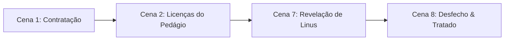

---
tags:
  - projeto/rpg
  - campanha/tormenta20
  - status/producao
  - tema/parodia-tecnologica
  - t20/reino-das-janelas
  - inimigo
sistema: Tormenta20
tipo: NPC
nome: Rei Bill
titulo: Soberano do Reino das Janelas
nivel: 5
fraqueza: Travar em processamento / Diplomacia sem intimidação
hp_max: 85
---

# 👑 Rei Bill, Soberano das Janelas
> "Tome cuidado com suas palavras. Um Rei não é governado por ameaças, mas por sabedoria." — Rei Bill

![[king_bill_portrait.png]]

---

## 📜 Visão Geral & Personalidade
O Rei Bill é o bem-intencionado, porém burocrático e travado imperador do **Reino das Janelas**. Ele é um homem de meia-idade com barba grisalha bem aparada, vestindo mantos reais em tons de azul e dourado. Pessoalmente, é extremamente educado e acolhedor, mas gerencia seu reino através de uma rede cansativa de licenças, taxas anuais, atualizações de leis compulsórias e obras intermináveis.

* **Tom de Voz:** Fala pausada, reticente e ritmada, travando no meio das frases por 2 a 3 segundos como se estivesse "carregando" a próxima palavra.
* **Localização:** Prefere passar o tempo no jardim dos fundos do Castelo das Janelas, admirando a vista da campina.

---

## 📍 Aparências no Roteiro

* **Cena 1 (A Convocação):** Oferece a missão de resgate dos moradores de Azura pagando **2.000 Tibares + 100 Tibares por vida salva** (50% adiantado).
* **Cena 8a (Lealdade):** Concede honrarias de Heróis de Estado se o grupo trouxer o povo de volta à força.
* **Cena 8b (Mediação):** Aceita a contragosto conversar com Linus para formalizar um tratado de paz.

---

## 🎭 Diretrizes de Roleplay & Reações

### 💬 Negociação de Recompensa (Diplomacia)
* **Sucesso CD 15:** Aumenta para 2.300 Tibares + 120 por vida.
* **Sucesso CD 25:** Aumenta para 3.000 Tibares + 150 por vida.

### ⚠️ Reação a Intimidações ou Agressividade
* **Ameaça Moderada:** *"Tome cuidado com suas palavras. Um Rei não é governado por ameaças, mas por sabedoria."*
* **Ameaça Agressiva:** *"Retiro minha oferta. Agora, considerem isso um teste de sua honra, pois o Reino das Janelas não pagará mercenários sem respeito."* (A vida do grupo passa a ser a recompensa).

---

## 🖼️ Galeria

| Retrato Principal | Nos Jardins Reais |
| :---: | :---: |
| ![[king_bill_portrait.png]] | ![[king_bill_garden_fullbody.png]] |

---

## 📊 Estatísticas para o Dataview
* **Nome do Arquivo:** `Rei Bill.md`
* **Nível:** `5`
* **Fraqueza:** `Processamento Lento / Diálogo Directo`
* **HP Máximo:** `85`