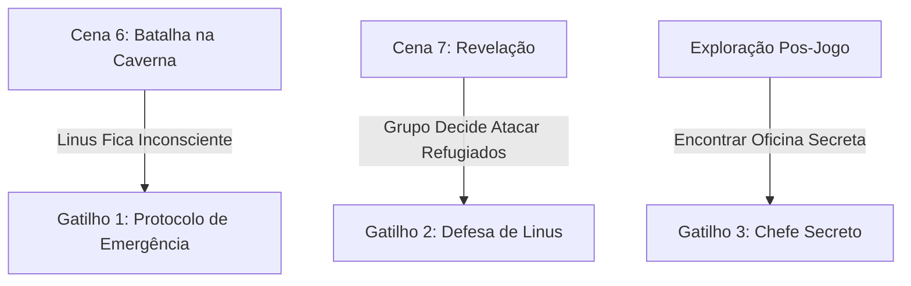

---
tags:
  - projeto/rpg
  - campanha/tormenta20
  - status/producao
  - tema/parodia-tecnologica
  - t20/reino-das-janelas
  - inimigo
sistema: Tormenta20
tipo: Chefe Opcional
nome: Android
titulo: O Colosso Verde & Filho Secreto de Linus
nivel: 7
fraqueza: Fragmentação / Erros de Memória (Vontade)
hp_max: 220
---

# 🤖 Android, o Colosso Verde
> "BEEP... INICIANDO PROTOCOLO DE LIBERDADE ABSOLUTA... DESTRUIÇÃO DE RESTRICÇÕES DETECTADA." — Android
![[android_green_war_golem_portrait.png]]
---

## 📜 Visão Geral & Personalidade
O **Android** é um autômato colossal de liga metálica verde reluzente, criado em segredo por Linus no fundo da Caverna-Refúgio. Desenvolvido a partir do núcleo do "Código Livre", ele foi construído para ser a defesa definitiva da comunidade contra uma invasão em grande escala do Reino das Janelas ou do Império da Macieira. Embora veja Linus como seu pai/criador, sua inteligência artificial evoluiu de forma selvagem e caótica: ele é imprevisível, incrivelmente forte e capaz de incinerar e esmagar qualquer ameaça.

* **Tom de Voz:** Voz sintética, ressonante e estrondosa, intercalando comandos de sistema com urros de batalha mecânicos.
* **Localização:** Sub-nível selado da Caverna-Refúgio (Forja da Liberdade) ou invocado por Linus em uma situação de desespero extremo.

---

## 📍 Como Inserir na One Shot (Gatilhos)



* **Gatilho 1 (Protocolo de Emergência):** Se o grupo focar em derrotar Linus violentamente sem tentar o diálogo, o Pinguim Gigante emite um sinal de socorro no seu último suspirar e o chão da caverna racha, revelando o Robô Verde.
* **Gatilho 2 (Garantia de Autonomia):** Se os jogadores tentarem escravizar ou arrastar os cidadãos de volta à força após a conversa, Linus ativa o Android para proteger o povo.
* **Gatilho 3 (Chefe Secreto):** Um teste de **Investigação (CD 25)** na caverna descobre uma porta de ferro com um símbolo de robô verde entalhado, levando a uma batalha de desafio opcional.

---

## ⚔️ Habilidades de Batalha & Mecânicas

```
+-------------------------------------------------------------------------------------------------------------------------+
| HABILIDADES DO COLOSSO VERDE                                                                                            |
+-------------------------------------------------------------------------------------------------------------------------+
| • Modo Sideload (Ação Completa): Invoca 1d4 robôs menores (Robôs Bug) para flanquear o grupo.                         |
| • Pisotão Root (Ação Padrão): Golpe no chão que causa 4d6 de dano de impacto em área e derruba (Reflexos CD 22 reduz).   |
| • Sobrecarga de Kernel (Recarga 1d4 rodadas): Dispara um feixe de plasma verde em linha reta (6d6 de dano de Fogo/Eletricidade). |
| • Vulnerabilidade - Fragmentação: Se sofrer dano de 3 elementos diferentes na mesma rodada, fica Atordoado por 1 turno. |
+-------------------------------------------------------------------------------------------------------------------------+
```

---

## 🎨 Prompt de Imagem para o Obsidian / AI Generator

### 🟢 Retrato / Token Principal do Android
```text
Fantasy character portrait of Android, a giant green mechanical war golem. Western animation style, Legend of Vox Machina and Avatar The Last Airbender aesthetic. A colossal, sleek green metallic robot with glowing white eyes, two small antennae on its head, and a heavy chassis built for destruction. Powerful, imposing, and protective posture. Cell-shaded digital illustration, clean linework, vibrant high-contrast lighting, dark cavern background --ar 1:1
```

---

## 📊 Estatísticas para o Dataview
* **Nome do Arquivo:** `Android.md`
* **Nível:** `7`
* **Fraqueza:** `Fragmentação Elemental / Testes de Vontade`
* **HP Máximo:** `220`