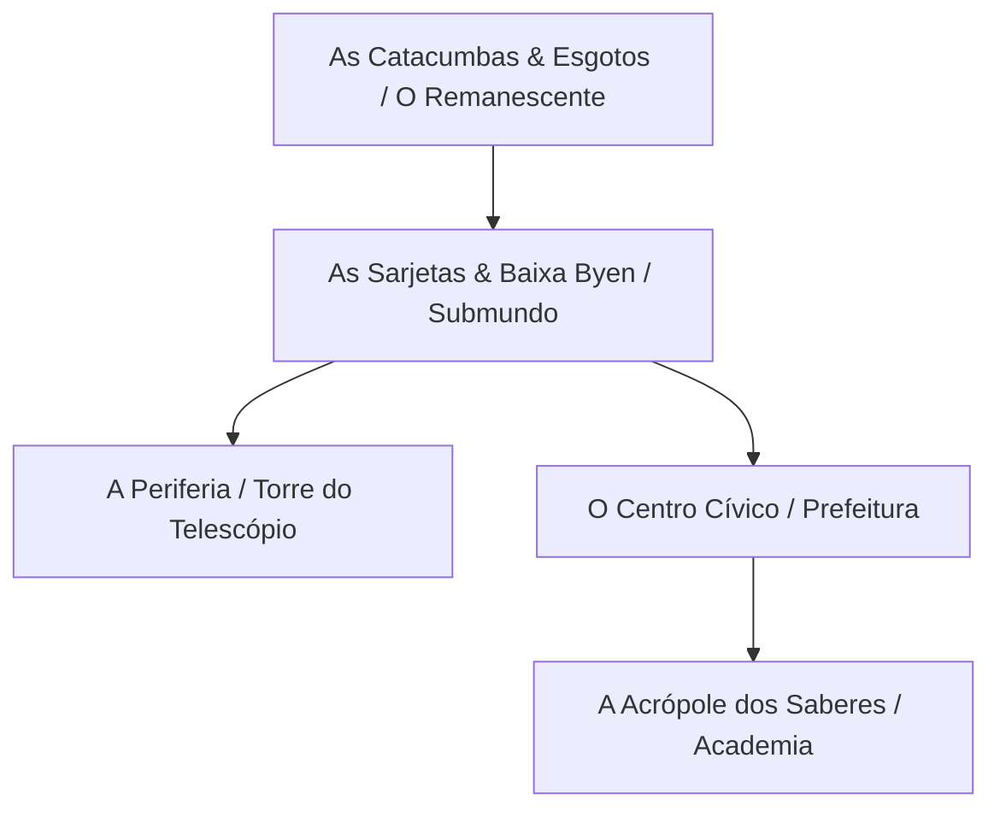

---
tags:
  - projeto/rpg
  - campanha/tormenta20
  - status/producao
  - tema/fantasia-sombria
  - t20/byen
  - cenario/cidade
sistema: Tormenta20
tipo: Cenario
nome: Byen, A Cidade da Razão
continente: Landet
governo: Tecnocracia Alquímica (Mestre Antonius) / Governo Civil (Burgomestre Alistair)
---

# 🏙️ Byen, A Cidade da Razão
> "Em Byen, o progresso ilumina o topo das torres enquanto o lixo das nossas mentes escorre invisível pelas sarjetas. É uma cidade linda... contanto que você nunca olhe para baixo." — Conselheira Sara Bell

![[byen_cityscape.png]]

---

## 📜 Visão Geral & Atmosfera

Erguida entre os vales frios do continente de **Landet**, **Byen** (pronuncia-se *Bü-en*) é a maior e mais orgulhosa metrópole do reino. Conhecida como a *Cidade da Razão*, ela foi desenhada para ser o monumento definitivo do intelecto humano sobre o caos do mundo: um lugar onde magos, eruditos e alquimistas governam através da ciência, da lógica e do progresso arcano.

Entretanto, a cidade é dividida por um contraste social e arquitetônico brutal. Quanto mais alto se sobe na topografia de Byen, mais brancos são os mármores, mais polidos são os latões e mais brilhantes são as luzes arcanas. Quanto mais se desce em direção aos rios e esgotos, mais a fumaça química sufoca as ruas, os cortiços se amontoam e o crime organizado dita as leis da sobrevivência.

---

## 🗺️ Divisão Geográfica & Distritos



### 🏛️ 1. A Acrópole dos Saberes (O Distrito Acadêmico)
* **Atmosfera:** Majestosa, fria, asséptica e silenciosa.
* **Características:** O ponto mais elevado da cidade. Ruas pavimentadas em pedra clara, torres de arquitetura neogótica arrojada, dirigíveis de carga e jardins suspensos. É aqui que reside a elite dos magos, filósofos e alquimistas.
* **Ponto de Interesse:** **A Grande Agulha Alquímica**, o arranha-céu/laboratório do Mestre Antonius, e o Grande Auditório do Conselho.

### 📜 2. O Centro Cívico (A Alta Byen)
* **Atmosfera:** Opulenta, burocrática e movimentada.
* **Características:** O coração comercial e aristocrático de Byen. Repleto de mercados de luxo, guildas de mercadores, bancos e mansões da burguesia. É a área mantida impecável para os olhos dos visitantes e nobres de fora.
* **Ponto de Interesse:** **O Palácio do Burgomestre**, onde Alistair dá suas festas e a Conselheira Sara Bell administra a burocracia do reino.

### 🏭 3. As Sarjetas & Baixa Byen (O Submundo)
* **Atmosfera:** Úmida, fétida, opressiva e mergulhada em névoa química.
* **Características:** Construída nos desfiladeiros abaixo da cidade alta. O sol raramente toca o chão aqui, bloqueado pelas pontes e aquedutos das classes abastadas. As vielas são estreitas, repletas de cortiços de madeira podre, vapor escapando de canos e becos controlados por gangues.
* **Ponto de Interesse:** **A Refinaria Subterrânea**, velhos complexos industriais abandonados onde a escória alquímica dos Acadêmicos é descarregada.

### 🔭 4. A Periferia & Os Morros Abandonados
* **Atmosfera:** Desolada, decadente e ventosa.
* **Características:** As ruínas fora das muralhas principais de Byen, compostas por antigos observatórios, cemitérios desativados e acampamentos de miseráveis que fugiram da violência do submundo.
* **Ponto de Interesse:** **A Antiga Torre do Telescópio Abandonado**, a fortaleza estratégica e escondeijo do Primaz Símio, de onde ele tem uma visão panorâmica de toda a metrópole.

### ✝️ 5. As Catacumbas do Remanescente (O Subterrâneo Profundo)
* **Atmosfera:** Silenciosa, sagrada e poeirenta.
* **Características:** Antigos túneis de pedra anteriores à fundação da Academia. É o único refúgio dos raros fiéis do **Criador**, que mantêm pequenos altares clandestinos iluminados a velas para fugir da perseguição dos Acadêmicos céticos.

---

## 🎨 Prompts para IA (Estilo Animação Ocidental: Arcane / Vox Machina)

> [!tip] Diretriz Visual
> Mantenha o estilo de cel-shading detalhado, iluminação de alto contraste cinematográfico e forte distinção entre a luz dourada/branca da cidade alta e os tons verdes/rubros/sombrios da cidade baixa.

### 🖼️ 1. Panorama Geral de Byen (`byen_cityscape.png`)
```text
Wide cinematic animation landscape of a dark fantasy gothic metropolis, Arcane animation style. A divided city: at the top, gleaming white stone towers with brass spires and magical glowing bridges under a cold twilight sky. Below, a deep shadowy gorge filled with crowded wooden slums, green chemical smog, and glowing crimson lanterns. Dramatic scale, atmospheric lighting, high resolution --ar 16:9
```

### 🖼️ 2. A Acrópole dos Saberes (Cidade Alta)
```text
Full-body animation screenshot of a majestic academic district, Arcane animation style. Pristine marble plazas, grand gothic spires with brass astronomy gears, scholars in robes walking under bright golden sunlight filtering through clean air. Opulent, serene, and cold atmosphere, detailed line art, cinematic composition --ar 16:9
```
![[Academia Celestial entre Torres Douradas.png]]
### 🖼️ 3. As Sarjetas & O Submundo (Cidade Baixa)
```text
Full-body animation screenshot of a dark gritty underground alley in a fantasy city, Arcane animation style. Narrow wet cobblestone streets, pipes leaking green alchemy steam, crowded wooden tenements blot out the sky, glowing red alchemy lanterns hanging from rusted chains. Dark atmospheric lighting, moody shadows --ar 16:9
```
![[Beco Steampunk sob Luzes Rubras e Verdes.png]]
---

## 💡 Segredos de Mestre & Fermentação da Tormenta

1. **Os Rios de Reagente V:** A alta cúpula dos Acadêmicos descarta secretamente toneladas de dejetos alquímicos e resíduos do Reagente V nos canais subterrâneos da cidade. Essa contaminação silenciosa é a verdadeira causa da loucura, violência e mutações crescentes entre os moradores das Sarjetas.
2. **A Ilusão da Luz:** Toda a iluminação arcana das torres de Byen é mantida por um gerador central na base da Academia que consome pequenos cristais de Matéria Vermelha estabilizada. A própria "luz da razão" da cidade é alimentada pelo pecado da Tormenta.
3. **A Guerra Inevitável:** As gangues da sarjeta (*Gangue da Gangrena*, *Princesa MaisGrana*, *Velho Fusco*) estão prestes a entrar em colapso devido ao avanço militar da *Facção do Símio*. Quando a bomba do Símio for revelada, o pânico no Centro Cívico será instantâneo.

---

## 📊 Estatísticas para o Dataview
- **Nome do Arquivo:** `A Cidade de Byen.md`
- **Continente:** `Landet`
- **Tipo:** `Metrópole Tecnocrática / Fantasia Urbana`