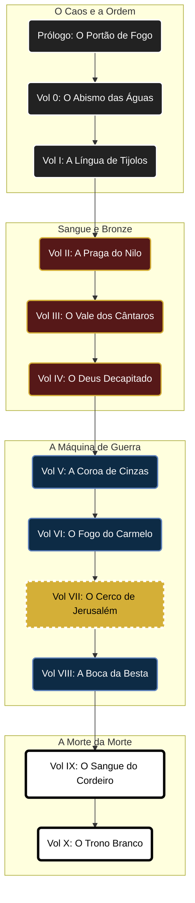

# 🌌 Antologia: A Batalha dos Deuses
**Tags:** #projeto-macro #antologia #bíblico #realismo-poético-brutal #roadmap
**Status:** 🔭 Planejamento de Longo Prazo
**Universo:** [[Cosmogonia Narrativa]]

> *"A História não é um rio calmo; é uma série de colisões violentas entre o Trono de Deus e os altares dos homens."*

---

## 📋 Conceito Central
Uma série antológica de ficção histórica e fantástica que reexamina os grandes confrontos espirituais da Bíblia.
Não são histórias de "escola dominical". São relatos de **Guerra Espiritual** vistos através da lente do **[[Realismo Poético Brutal]]**. Cada volume foca em um momento onde uma entidade (Deus, Estado, Tecnologia, Demônio) desafiou YHWH publicamente e recebeu uma resposta devastadora.

### 🎨 A Estética Unificadora
* **Textura:** Sujeira, sangue, suor, engenharia, fome e êxtase.
* **Ameaça:** O inimigo nunca é caricato; ele é poderoso, sedutor e aterrorizante.
* **Redenção:** A luz brilha mais forte porque o fundo é preto absoluto.

---

## 🗺️ O Mapa da Guerra (Roadmap)

## 📚 Os Volumes (Sinopses)

### 🍎 Prólogo: O Portão de Fogo (A Queda)
* **Base:** Gênesis 3.
* **O Inimigo:** A **Mentira** e a **Autossuficiência**.
* **Tema:** *A Ruptura*. O momento em que a realidade quebrou.
* **Atmosfera:** Trauma Primordial.
    * *O Som:* Não o da mordida na fruta, mas o "crack" teológico do universo se dividindo.
    * *O Visual:* A primeira vez que Adão vê sangue (o animal morto para fazer as vestes). O choque de ver os Querubins (monstros quiméricos) bloqueando o caminho de casa com espadas de plasma giratórias.
* **Link:** [[Projetos/O Portão de Fogo]]

### 🌊 Vol 0: O Abismo das Águas (O Dilúvio)
* **Base:** Gênesis 6-9.
* **O Inimigo:** O **Caos** e os **Nefilins** (A violência da carne).
* **Tema:** *A Des-Criação*. O horror de ver o mundo sendo "formatado".
* **Atmosfera:** Horror Cósmico. Chuva incessante, madeira estalando, monstros batendo no casco da Arca.
* **Link:** [[Projetos/O Abismo das Águas]]

### 🧱 Vol I: A Língua de Tijolos (Babel)
* **Base:** Gênesis 11.
* **O Inimigo:** O **Coletivismo Tecnológico** e o Humanismo.
* **Tema:** *A Uniformidade vs. A Individualidade*.
* **Atmosfera:** Distopia Ancestral. Fornalhas industriais, arquitetura brutalista, a vertigem da altura e o terror cognitivo da confusão das línguas.
* **Link:** [[Projetos/A Língua de Tijolos]]

### 🩸 Vol II: A Praga do Nilo (Êxodo)
* **Base:** Êxodo 7-12.
* **O Inimigo:** O **Panteão Egípcio** (Deuses da Natureza/Morte).
* **Tema:** *A Vida vs. A Morte*.
* **Atmosfera:** Guerra Biológica. O cheiro de sangue no rio, a escuridão tátil, o silêncio dos primogênitos morrendo. O desmantelamento sistemático de Rá, Hapi e Osíris.
* **Link:** [[Projetos/A Praga do Nilo]]

### 🏺 Vol III: O Vale dos Cântaros (Gideão)
* **Base:** Juízes 6-8.
* **O Inimigo:** **Midiã** (O Enxame / A Escassez).
* **Tema:** *A Fraqueza como Estratégia*.
* **Atmosfera:** Guerra de Guerrilha Noturna.
    * *A Cena:* O silêncio absoluto sendo quebrado pelo som de 300 jarros de barro explodindo simultaneamente e tochas iluminando o terror nos olhos dos midianitas.
* **Link:** [[Projetos/O Vale dos Cântaros]]

### 🗿 Vol IV: O Deus Decapitado (A Arca vs. Dagom)
* **Base:** 1 Samuel 5-6.
* **O Inimigo:** **Dagom** e a **Superstição**.
* **Tema:** *A Santidade Ofensiva*.
* **Atmosfera:** *Plague Tale* Bíblico (Horror Sobrenatural).
    * *POV:* Um zelador do templo filisteu que vive nas sombras.
    * *O Horror:* A praga de ratos (1 Sm 6:4) agindo como uma maré viva, fugindo da Glória da Arca e derrubando a estátua de Dagom. O ídolo prostrado, sem cabeça e sem mãos, no meio de um tapete de roedores.
* **Link:** [[Projetos/O Deus Decapitado]]

### 👑 Vol V: A Coroa de Cinzas (Saul & Endor)
* **Base:** 1 Samuel 28 (A Médium de Endor) e o suicídio de Saul.
* **O Inimigo:** O **Oculto** e a **Loucura**.
* **Tema:** *A Unção vs. O Ego*.
* **Atmosfera:** Terror Psicológico. Cavernas escuras, sussurros, a sombra de Samuel subindo da terra. A mente de um rei se fragmentando.
* **Link:** [[Projetos/A Coroa de Cinzas]]

### 🔥 Vol VI: O Fogo do Carmelo (Elias)
* **Base:** 1 Reis 18.
* **O Inimigo:** **Baal** (A Idolatria Sexual/Violenta).
* **Tema:** *O Ruído vs. A Resposta*.
* **Atmosfera:** Ação Frenética (*Mad Max* Bíblico). Calor do deserto, automutilação dos profetas de Baal, o riso selvagem de Elias e o fogo caindo como um martelo.
* **Link:** [[Projetos/O Fogo do Carmelo]]

### ⚔️ Vol VII: O Cerco de Jerusalém (Senaqueribe)
* **Status:** 🚧 **EM PRODUÇÃO**
* **Base:** 2 Reis 18-19.
* **O Inimigo:** A **Máquina de Guerra** (Assíria).
* **Tema:** *A Fé vs. A Lógica Militar*.
* **Atmosfera:** Thriller de Cerco. Tensão, claustrofobia, logística da fome e o silêncio da morte noturna.
* **Link:** [[A Batalha dos Deuses|Vol V: O Cerco]]

### 🦁 Vol VIII: A Boca da Besta (Daniel)
* **Base:** Daniel 3 e 6.
* **O Inimigo:** O **Estado Divinizado** (Babilônia/Pérsia).
* **Tema:** *A Lei de Deus vs. A Lei dos Homens*.
* **Atmosfera:** Política e Milagre. O calor impossível da fornalha, o cheiro de amônia na cova dos leões, a frieza burocrática dos decretos de morte.
* **Link:** [[Projetos/A Boca da Besta]]

### ✝️ Vol IX: O Sangue do Cordeiro (Paixão)
* **Base:** Evangelhos.
* **O Inimigo:** A **Religião Morta** e **César**.
* **Tema:** *O Sacrifício como Arma*.
* **Atmosfera:** Realismo Brutal. A crucificação não como derrota, mas como o D-Day da invasão divina. O céu escurecendo, o véu rasgando.
* **Link:** [[Projetos/O Sangue do Cordeiro]]

### ⚖️ Vol X: O Trono Branco (Apocalipse)
* **Base:** Apocalipse.
* **O Inimigo:** O **Dragão**.
* **Tema:** *A Justiça Final*.
* **Atmosfera:** Épico Transcendente. O fim do tempo, o guerreiro de vestes tintas de sangue, o silêncio do julgamento.
* **Link:** [[Projetos/O Trono Branco]]

---

## ⏳ Linha do Tempo Comparativa

| Ano (Aprox.) | Volume | Inimigo Principal | Evento Chave |
| :--- | :--- | :--- | :--- |
| Pré-História | **Prólogo** | O Pecado | A Expulsão do Jardim |
| Pré-História | **Vol 0** | A Carne / Nefilins | O Dilúvio |
| Pré-História | **Vol I** | Tecnologia / Ego | Torre de Babel |
| 1446 a.C. | **Vol II** | Deuses do Egito | A Páscoa / Mar Vermelho |
| 1170 a.C. | **Vol III** | Midiã (Enxame) | Os 300 de Gideão |
| 1050 a.C. | **Vol IV** | Dagom / Superstição | A Queda do Ídolo / Ratos |
| 1010 a.C. | **Vol V** | Ocultismo | A Sessão em Endor |
| 850 a.C. | **Vol VI** | Baal | Fogo no Carmelo |
| 701 a.C. | **Vol VII** | Máquina Assíria | A Noite dos 185.000 |
| 539 a.C. | **Vol VIII** | O Estado | Cova dos Leões |
| 33 d.C. | **Vol IX** | A Morte | A Cruz |
| Futuro | **Vol X** | O Mal Absoluto | O Armagedom |

---
*"Eu sou o Alfa e o Ômega, o Princípio e o Fim."*